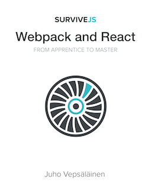

 

# SurviveJS - Webpack and React

> **IMPORTANT!** If you want to support the development of this book, you can [purchase a copy at Leanpub](https://leanpub.com/survivejs_webpack). Feedback is valuable as well.

webpack, a module bundler, solves a significant problem for web developers. It can be daunting to learn but once you grok it, life gets easier. Same goes for React, a JavaScript library for building UIs. This book shows you how to build a little Kanban application using these technologies. During the process you will learn the basics and will be able to take the skills to your own projects.

## How to Use This Repository?

The repository has been split in two main parts: `manuscript` and `project_source`. You can find the book in its entirety under `manuscript` organized per chapter. `project_source` contains source associated to each chapter.

There is no single right way to approach the book. It depends on your experience level and interest. You can build the project from scratch by following the book or you can start from a specific stage. Just pick the source from previous chapter as your starting point.

## Contributing

Feedback is welcome. You can provide it through [the issue tracker](https://github.com/survivejs/webpack_react/issues).

## Generating PDF

If you want a rough pdf version, you can generate one through Calibre. It won't look as pretty as [the official version](https://leanpub.com/survivejs_webpack) and will be missing some content. That said it's better than nothing if you cannot afford the full monty for a reason or another. I'm not blaming you. :)

Make sure you have Calibre installed before trying the generation script. You can get it from [Calibre site](http://calibre-ebook.com/download) or alternatively you can use the package manager of your operating system (Homebrew-cask for Mac, `sudo apt-get install calibre calibre-bin` for Ubuntu). If you use Homebrew-cask, you may need to add the Calibre CLI to your PATH (e.g., `export PATH=$PATH://opt/homebrew-cask/Caskroom/calibre/2.31.0/calibre.app/Contents/MacOS`).

To generate a pdf version of the book, hit `npm install` and `npm start`. After that you should have `./book.pdf`.

## License

