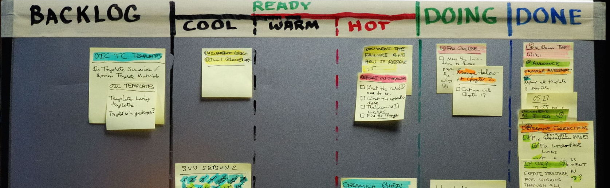

# Introduction

Front-end development moves forward fast. In this book we'll discuss  [Webpack](https://webpack.github.io/) and [React](https://facebook.github.io/react/). Combined, these tools allow you to build all sorts of web applications swiftly. Knowledge of Webpack is useful beyond React. Understanding React will allow you to see the alternatives in a different light.

## What is Webpack?

Web browsers have been designed to consume HTML, JavaScript, and CSS. The simplest way to develop is simply to write files that the browser understands directly. The problem is that this becomes unwieldy eventually. This is particularly true when you are developing web applications.

There are multiple ways to approach this problem. You can start splitting up your JavaScript and CSS to separate files for example. You could load dependencies through `script` tags. Even though better, it is still a little problematic. If you want to use technologies that compile to these target formats, you will need to introduce preprocessing steps. Task runners, such as Grunt and Gulp, allow you to achieve this but even then you need to write a lot of configuration by hand.

Webpack takes another route. It allows you to treat your project as a dependency graph. You could have a *index.js* in your project that pulls in the dependencies the project needs through standard `import` statements. You can refer to your style files and other assets the same way.

Webpack does all the preprocessing for you and gives you the bundles you specify through configuration. This declarative approach is powerful but a little difficult to learn. Once you begin to understand how Webpack works, it becomes an indispensable tool. This book has been designed to get through that initial learning curve.

## What is React?

Facebook's React, a JavaScript library, is a component based view abstraction. A component could be a form input, button, or any other element in your user interface. This provides an interesting contrast to earlier approaches as React isn't bound to the DOM by design. You can use it to implement mobile applications for example.

Given React focuses only on the view you'll likely have to complement it with other libraries to give you the missing bits. This provides an interesting contrast to framework based approaches as they give you a lot more out of the box.

Both framework and library based approaches have their merits. You may even use React with a framework so it's not an either-or proposition. Ideas introduced by React have influenced the development of the frameworks so you can find familiar concepts there. Most importantly it has helped us to understand how well component based thinking fits web applications.

## How is This Book Organized?

This book will guide you through a small example project. After completing it, we discuss more theoretical aspects of web development. The project in question will be a small [Kanban](https://en.wikipedia.org/wiki/Kanban) application.

We will start by building a Webpack based configuration. After that we will develop a small clone of a famous [Todo application](http://todomvc.com/). We will generalize from there and put in place [Flux architecture](https://facebook.github.io/flux/docs/overview.html) within our application. We will apply some [Drag and Drop (DnD) magic](https://gaearon.github.io/react-dnd/) and start dragging things around. Finally we will get a production grade build done.

After that we have a couple of Leanpub exclusive chapters in which we discuss how to:

* Deal with typing in React.
* Test your components and logic.

The final part of the book focuses on the tooling. Through the chapters included you will learn to:

* Lint your code effectively using [ESLint](http://eslint.org/) and some other tools.
* Author libraries at [npm](https://www.npmjs.com/).
* Style React in various emerging ways.

## What is Kanban?

Kanban, originally developed at Toyota, allows you to track the status of tasks. It can be modeled as `Lanes` and `Notes`. `Notes` move through `Lanes` representing stages from left to right as they become completed. `Notes` themselves can contain information about the task itself, its priority, and so on.

The simplest way to build a Kanban is to get a bunch of Post-it notes and find a wall. After that you split it up into columns. These `Lanes` could consist of the following stages: Todo, Doing, Done. All `Notes` would go to Todo initially. As you begin working on them, you would move them to Doing, and finally to Done when completed. This is the simplest way to get started.

As the system gets more sophisticated you can start applying concepts such as a limit on Work In Progress (WIP). The effect of this is that you are forced to focus on getting tasks done. That is one of the good consequences of using Kanban. Moving those notes around is satisfying. As a bonus you get visibility and know what is yet to be done.

A good example of Kanban in action on the web is [Trello](https://trello.com/). Sprintly has open sourced their [React implementation of Kanban](https://github.com/sprintly/sprintly-kanban). Ours won't be as sophisticated, but it will be enough to get started.

## Who is This Book for?

I expect that you have a basic knowledge of JavaScript and Node.js. You should be able to use npm. If you know something about Webpack or React, that's great. By reading this book you will deepen your understanding of these tools.

## Extra Material

The book content and source are available at [GitHub](https://github.com/survivejs/webpack_react). This allows you to start from any chapter you want.

You can also find alternative implementations of the application using [mobservable](https://github.com/survivejs/mobservable-demo), [Redux](https://github.com/survivejs/redux-demo), and [Cerebral/Baobab](https://github.com/survivejs/cerebral-demo). Studying those can give you a good idea of how different architectures work out using the same example.

## Getting Support

As no book is perfect, you will likely come by issues and might have some questions related to the content. There are a couple of options:

* [GitHub Issue Tracker](https://github.com/survivejs/webpack_react/issues)
* [Gitter Chat](https://gitter.im/survivejs/webpack_react)
* Twitter - [@survivejs](https://twitter.com/survivejs) or poke me through [@bebraw](https://twitter.com/bebraw)
* Email - [info@survivejs.com](mailto:info@survivejs.com)

If you post questions to Stack Overflow, tag them using `survivejs` so I will get notified of them.

I have tried to cover some common issues at the `Troubleshooting` appendix. That will be expanded as common problems are found.

## Announcements

I announce SurviveJS related news through a couple of channels:

* [Mailing list](http://eepurl.com/bth1v5)
* [Twitter](https://twitter.com/survivejs)
* [Blog RSS](http://survivejs.com/atom.xml)

Feel free to subscribe.

## Acknowledgments

Big thanks to [Christian Alfoni](http://www.christianalfoni.com/) for starting the [react-webpack-cookbook](https://github.com/christianalfoni/react-webpack-cookbook) with me. That work eventually lead to this book.

The book wouldn't be half as good as it is without patient editing and feedback by my editor [Jesús Rodríguez Rodríguez](https://github.com/Foxandxss). Thank you.

Special thanks to Steve Piercy for numerous contributions. Thanks to [Prospect One](http://prospectone.pl/) for helping with the logo and graphical outlook. Thanks for proofreading to Ava Mallory and EditorNancy from fiverr.com.

Numerous individuals have provided support and feedback along the way. Thank you in no particular order Vitaliy Kotov, @af7, Dan Abramov, @dnmd, James Cavanaugh, Josh Perez, Nicholas C. Zakas, Ilya Volodin, Jan Nicklas, Daniel de la Cruz, Robert Smith, Andreas Eldh, Brandon Tilley, Braden Evans, Daniele Zannotti, Partick Forringer, Rafael Xavier de Souza, Dennis Bunskoek, Ross Mackay, Jimmy Jia, Michael Bodnarchuk, Ronald Borman, Guy Ellis, Mark Penner, Cory House, Sander Wapstra, Nick Ostrovsky, Oleg Chiruhin, Matt Brookes, Devin Pastoor, Yoni Weisbrod, Guyon Moree, Wilson Mock, Herryanto Siatono, Héctor Cascos, Erick Bazán, Fabio Bedini, Gunnari Auvinen, Aaron McLeod, John Nguyen, Hasitha Liyanage, Mark Holmes, Brandon Dail, Ahmed Kamal, Jordan Harband, Michel Weststrate, Ives van Hoorne, Luca DeCaprio, @dev4Fun, Fernando Montoya, Hu Ming, @mpr0xy, David Gómez, Aleksey Guryanov, Elio D'antoni, Yosi Taguri, Ed McPadden, Wayne Maurer, Adam Beck, Omid Hezaveh, Connor Lay, Nathan Grey, Avishay Orpaz, Jax Cavalera, Juan Diego Hernández, Peter Poulsen, Harro van der Klauw, Tyler Anton, Michael Kelley, @xuyuanme, @RogerSep, Jonathan Davis, and @snowyplover. If I'm missing your name, I might have forgotten to add it.
