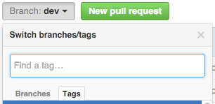

# Introduction

Front-end development moves forward fast. A good indication of this is the pace in which new technologies appear to the scene. [Webpack](https://webpack.github.io/) and [React](https://facebook.github.io/react/) are two recent newcomers. Combined, these tools allow you to build all sorts of web applications swiftly. Most importantly, learning these tools provides you perspective. That's what this book is about.

## What is Webpack?

Web browsers have been designed to consume HTML, JavaScript, and CSS. The simplest way to develop is simply to write files that the browser understands directly. The problem is that this becomes unwieldy eventually. This is particularly true when you are developing web applications.

There are multiple ways to approach this problem. You can start splitting up your JavaScript and CSS to separate files. You could load dependencies through `script` tags. Even though this is better, it is still a little problematic.

If you want to use technologies that compile to these target formats, you will need to introduce preprocessing steps. Task runners, such as Grunt and Gulp, allow you to achieve this, but even then you need to write a lot of configuration by hand.

### How Webpack Changes the Situation?

Webpack takes another route. It allows you to treat your project as a dependency graph. You could have an *index.js* in your project that pulls in the dependencies the project needs through standard `import` statements. You can refer to your style files and other assets the same way.

Webpack does all the preprocessing for you and gives you the bundles you specify through configuration. This declarative approach is powerful, but it is a little difficult to learn. However, once you begin to understand how Webpack works, it becomes an indispensable tool. This book has been designed to get through that initial learning curve.

## What is React?

Facebook's React, a JavaScript library, is a component based view abstraction. A component could be a form input, button, or any other element in your user interface. This provides an interesting contrast to earlier approaches as React isn't bound to the DOM by design. You can use it to implement mobile applications for example.

### React is Only One Part of the Whole

Given React focuses only on the view, you'll likely have to complement it with other libraries to give you the missing bits. This provides an interesting contrast to framework based approaches as they give you a lot more out of the box. Both approaches have their merits. In this book, we will focus on the library oriented approach.

Ideas introduced by React have influenced the development of the frameworks. Most importantly it has helped us to understand how well component based thinking fits web applications.

## What Will You Learn?


This book teaches you to build a [Kanban](https://en.wikipedia.org/wiki/Kanban) application. Beyond this, more theoretical aspects of web development are discussed. Completing the project gives you a good idea of how to implement something on your own. During the process you will learn why certain libraries are useful and will be able to justify your technology choices better.

## How is This Book Organized?

We will start by building a Webpack based configuration. After that, we will develop a small clone of a famous [Todo application](http://todomvc.com/). This leads us to problems of scaling. Sometimes, you need to do things the dumb way to understand why better solutions are needed after all.

We will generalize from there and put [Flux architecture](https://facebook.github.io/flux/docs/overview.html) in place. We will apply some [Drag and Drop (DnD) magic](https://gaearon.github.io/react-dnd/) and start dragging things around. Finally, we will get a production grade build done.

The final, theoretical part of the book covers more advanced topics. If you are reading the commercial edition of this book, there's something extra in it for you. I will show you how to deal with typing in React in order to produce higher quality code. You will also learn to test your components and logic.

I will also show you how to lint your code effectively using [ESLint](http://eslint.org/) and various other tools. There is a chapter in which you learn to author libraries at [npm](https://www.npmjs.com/). The lessons learned there will come in handy for applications as well. Finally, you will learn to style your React application in various emerging ways.

There are a couple of appendices at end. They are meant to give food for thought and explain aspects, such as language features, in greater detail. If there's a bit of syntax that seems weird to you in the book, you'll likely find more information there.

## What is Kanban?


Kanban, originally developed at Toyota, allows you to track the status of tasks. It can be modeled in terms of `Lanes` and `Notes`. `Notes` move through `Lanes` representing stages from left to right as they become completed. `Notes` themselves can contain information about the task itself, its priority, and so on as required.

The system can be extended in various ways. One simple way is to apply a Work In Progress (WIP) limit per lane. The effect of this is that you are forced to focus on getting tasks done. That is one of the good consequences of using Kanban. Moving those notes around is satisfying. As a bonus you get visibility and know what is yet to be done.

### Where to Use Kanban?

This system can be used for various purposes, including software and life management. You could use it to track your personal projects or life goals for instance. Even though it's a simple tool, it's quite powerful, and you can find use for it in many places.

### How to Build a Kanban?

The simplest way to build a Kanban is to get a bunch of Post-it notes and find a wall. After that, you split it up into columns. These `Lanes` could consist of the following stages: Todo, Doing, Done. All `Notes` would go to Todo initially. As you begin working on them, you would move them to Doing, and finally, to Done when completed. This is the simplest way to get started.

This is just one example of a lane configuration. The lanes can be configured to match your process. There can be approval steps for instance. If you are modeling a software development process, you could have separate lanes for testing and deployment for instance.

### Available Kanban Implementations

[Trello](https://trello.com/) is perhaps the most known online implementation of Kanban. Sprintly has open sourced their [React implementation of Kanban](https://github.com/sprintly/sprintly-kanban). Meteor based [wekan](https://github.com/wekan/wekan) is another good example. Ours won't be as sophisticated as these, but it will be enough to get started.

## Who is This Book for?

I expect that you have a basic knowledge of JavaScript and Node.js. You should be able to use npm on an elementary level. If you know something about Webpack, React, or ES6, that's great. By reading this book you will deepen your understanding of these tools.

One of the hardest things about writing a book is to write it on the right level. Given the book covers a lot of ground, there are appendices that cover basic topics, such as language details, with greater detail than the main content does.

If you find yourself struggling, consider studying the appendices or seeking help from the  community around the book. In case you are stuck or don't understand something, we are there to help. Any comments you might have will go towards improving the book content.

## How to Approach the Book?

Although a natural way to read a book is to start from the first chapter and then read the chapters sequentially, that's not the only way to approach this book. The chapter order is just a reading suggestion. Depending on your background, you could consider the following orders or even skip some portions altogether:

* From start to end - This would be the traditional way to approach a book. It will also require the most amount of time. But on the plus side you get a steady progression.
* React first, Webpack after - An alternative is to skip the early chapters on Webpack, download [a starting point](https://github.com/survivejs/webpack_react/tree/master/project_source/03_webpack_and_react/kanban_app) from the repository, and go through the Kanban demonstration first. Follow the Webpack chapters after that to understand what the configuration is doing and why. The *Advanced Techniques* part and appendices complement this content well.
* Webpack only - If you know React very well, maybe it makes sense to go through the Webpack portions only. You can apply the same skills beyond React after all.
* Advanced techniques only - Given React ecosystem is so vast, the *Advanced Techniques* part covers interesting niches you might miss otherwise. Pick up techniques like linting or learn to improve your npm setup. It may be worth your while to dig into various styling approaches discussed to find something that suits your purposes.

The book doesn't cover everything you need to know in order to develop front-end applications. That's simply too much for a single book. I do believe, however, that it might be able to push you to the right direction. The ecosystem around Webpack and React is fairly large and I've done my best to cover a good chunk of it.

Given the book relies on a variety of new language features, I've gathered the most important ones used to a separate *Language Features* appendix that provides a quick look at them. If you want to understand the features in isolation or feel unsure of something, that's a good place to look.

## Book Versioning

Given this book receives a fair amount of maintenance and improvements due to the pace of innovation, there's a rough versioning scheme in place. I maintain release notes for each new version at the [book blog](http://survivejs.com/blog/). That should give you a good idea of what has changed between versions. Also examining the GitHub repository may be beneficial. I recommend using the GitHub *compare* tool for this purpose. Example:

```
https://github.com/survivejs/webpack_react/compare/v1.9.10...v1.9.17
```

The page will show you the individual commits that went to the project between the given version range. You can also see the lines that have changed in the book. This excludes the private chapters, but it's enough to give you a good idea of the major changes made to the book.

The current version of the book is **2.1.0**.

## Extra Material

The book content and source are available at [book's repository at GitHub](https://github.com/survivejs/webpack_react). Please note that the repository defaults to the `dev` branch of the project. This makes it convenient to contribute. To find source matching the version of the book you are reading, use the tag selector at GitHub's user interface as in the image below:



The book repository contains code per chapter. This means you can start from anywhere you want without having to type it all through yourself. If you are unsure of something, you can always refer to that.

You can find a lot of complementary material at the [survivejs organization](https://github.com/survivejs/). Examples of this are alternative implementations of the application available written in [mobservable](https://github.com/survivejs/mobservable-demo), [Redux](https://github.com/survivejs/redux-demo), and [Cerebral/Baobab](https://github.com/survivejs/cerebral-demo). Studying those can give you a good idea of how different architectures work out using the same example.

## Getting Support

As no book is perfect, you will likely come by issues and might have some questions related to the content. There are a couple of options to deal with this:

* Contact me through [GitHub Issue Tracker](https://github.com/survivejs/webpack_react/issues)
* Join me at [Gitter Chat](https://gitter.im/survivejs/webpack_react)
* Follow [@survivejs](https://twitter.com/survivejs) at Twitter for official news or poke me through [@bebraw](https://twitter.com/bebraw) directly
* Send me email at [info@survivejs.com](mailto:info@survivejs.com)
* Ask me anything about Webpack or React at [SurviveJS AmA](https://github.com/survivejs/ama/issues)

If you post questions to Stack Overflow, tag them using **survivejs** so I will get notified of them. You can use the hashtag **#survivejs** at Twitter for same effect.

I have tried to cover some common issues at the *Troubleshooting* appendix. That will be expanded as common problems are found.

## Announcements

I announce SurviveJS related news through a couple of channels:

* [Mailing list](http://eepurl.com/bth1v5)
* [Twitter](https://twitter.com/survivejs)
* [Blog RSS](http://survivejs.com/atom.xml)

Feel free to subscribe.

## Acknowledgments

An effort like this wouldn't be possible without community support. There are a lot of people to thank as a result!

Big thanks to [Christian Alfoni](http://www.christianalfoni.com/) for starting the [react-webpack-cookbook](https://github.com/christianalfoni/react-webpack-cookbook) with me. That work eventually led to this book.

The book wouldn't be half as good as it is without patient editing and feedback by my editor [Jesús Rodríguez Rodríguez](https://github.com/Foxandxss). Thank you.

Special thanks to Steve Piercy for numerous contributions. Thanks to [Prospect One](http://prospectone.pl/) and [Dixon & Moe](http://dixonandmoe.com/) for helping with the logo and graphical outlook. Thanks for proofreading to Ava Mallory and EditorNancy from fiverr.com.

Numerous individuals have provided support and feedback along the way. Thank you in no particular order Vitaliy Kotov, @af7, Dan Abramov, @dnmd, James Cavanaugh, Josh Perez, Nicholas C. Zakas, Ilya Volodin, Jan Nicklas, Daniel de la Cruz, Robert Smith, Andreas Eldh, Brandon Tilley, Braden Evans, Daniele Zannotti, Partick Forringer, Rafael Xavier de Souza, Dennis Bunskoek, Ross Mackay, Jimmy Jia, Michael Bodnarchuk, Ronald Borman, Guy Ellis, Mark Penner, Cory House, Sander Wapstra, Nick Ostrovsky, Oleg Chiruhin, Matt Brookes, Devin Pastoor, Yoni Weisbrod, Guyon Moree, Wilson Mock, Herryanto Siatono, Héctor Cascos, Erick Bazán, Fabio Bedini, Gunnari Auvinen, Aaron McLeod, John Nguyen, Hasitha Liyanage, Mark Holmes, Brandon Dail, Ahmed Kamal, Jordan Harband, Michel Weststrate, Ives van Hoorne, Luca DeCaprio, @dev4Fun, Fernando Montoya, Hu Ming, @mpr0xy, David "@davegomez" Gómez, Aleksey Guryanov, Elio D'antoni, Yosi Taguri, Ed McPadden, Wayne Maurer, Adam Beck, Omid Hezaveh, Connor Lay, Nathan Grey, Avishay Orpaz, Jax Cavalera, Juan Diego Hernández, Peter Poulsen, Harro van der Klauw, Tyler Anton, Michael Kelley, @xuyuanme, @RogerSep, Jonathan Davis, @snowyplover, Tobias Koppers, Diego Toro, George Hilios, Jim Alateras, @atleb, Andy Klimczak, James Anaipakos, Christian Hettlage, Sergey Lukin, Matthew Toledo, Talha Mansoor, Pawel Chojnacki, @eMerzh, Gary Robinson, Omar van Galen, Jan Van Bruggen, Savio van Hoi, Alex Shepard, Derek Smith, Tetsushi Omi, Maria Fisher, Rory Hunter, Dario Carella, Toni Laukka, Blake Dietz, Felipe Almeida, Greg Kedge, Deepak Kannan, and Jake Peyser. If I'm missing your name, I might have forgotten to add it.
