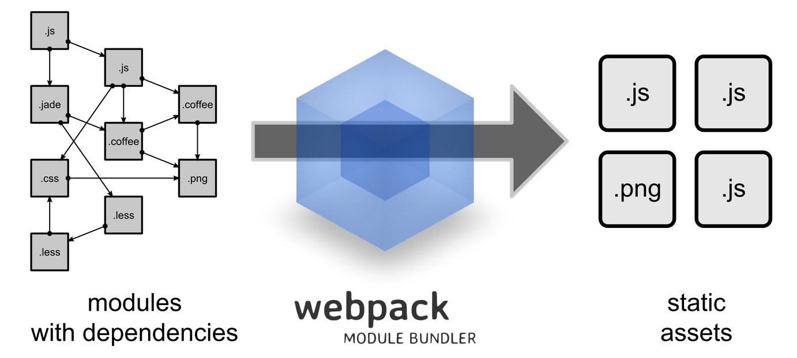

# Webpack Compared

To understand webpack, it will help to look at the history. That will put the tool in context and show you why the approach is powerful. Back in the day we were happy just to concat some scripts together but that won't do anymore. JavaScript libraries can be very large these days and nobody likes to wait for it all to load for the application to show up.

This problem has been escalated by the rise of Single Page Applications. They tend to rely on various quite heavy libraries and be complex by nature. Ideally you would just load the assets you need per page.

The popularity of Node.js and [npm](https://www.npmjs.com/), the Node.js package manager, provides more context. Before these developments, it was difficult to consume dependencies. Now that npm is used increasingly for frontend development, the situation has changed dramatically. Thanks to modern tooling we have nice ways to manage the dependencies of our frontend projects.

Historically speaking there have been many build systems. [Make](https://en.wikipedia.org/wiki/Make_%28software%29) is perhaps the most known one and still a viable option in many cases. In the world of frontend development particularly [Grunt](http://gruntjs.com/) and [Gulp](http://gulpjs.com/) have gained popularity. Both are made powerful by plugins available via npm.

## Grunt


Grunt went mainstream before Gulp. It was made popular particularly due to its plugin architecture. At the same time this is the Achilles' heel of Grunt. You **don't** want to end up having to maintain a 300 line `Gruntfile`. Just in case you are curious what Grunt configuration looks like, here's an example from [Grunt documentation](http://gruntjs.com/sample-gruntfile):

```javascript
module.exports = function(grunt) {
  grunt.initConfig({
    jshint: {
      files: ['Gruntfile.js', 'src/**/*.js', 'test/**/*.js'],
      options: {
        globals: {
          jQuery: true
        }
      }
    },
    watch: {
      files: ['<%= jshint.files %>'],
      tasks: ['jshint']
    }
  });

  grunt.loadNpmTasks('grunt-contrib-jshint');
  grunt.loadNpmTasks('grunt-contrib-watch');

  grunt.registerTask('default', ['jshint']);
};
```

In this sample we define two basic tasks related to `jshint`, a linting tool that helps you spot possible problem spots at your source. We have a standalone task for running the tool against our source. In addition we have a watcher based task. If we run it, we'll get warnings interactively at our terminal as we edit.

In practice you would have a lot of small tasks such as these for various purposes such as building the project. The example shows well how these tasks are constructed. An important part of the power of Grunt is that it hides a lot of the wiring from you. Taken too far this can get problematic though as you don't understand well enough what's going on under the hood.

T> Note that [grunt-webpack](https://www.npmjs.com/package/grunt-webpack) plugin allows you to use webpack in Grunt environment. You can leave the heavy lifting to webpack while utilizing the Grunt plugins you are familiar with.

## Gulp


Gulp takes a different approach. Instead of relying on configuration per plugin you deal with actual code. Gulp builds on top of the tried and true concept of piping. If you are familiar with Unix, it's the same here.

You simply have sources, filters and sinks. In this case sources happen to match to some files, filters perform some operations on those (e.g. convert to JavaScript) and then output to sinks (your build directory etc.).

Here's a sample `Gulpfile` to give you a better idea of the approach taken from the project README and abbreviated a bit:

```javascript
var gulp = require('gulp');
var coffee = require('gulp-coffee');
var concat = require('gulp-concat');
var uglify = require('gulp-uglify');
var sourcemaps = require('gulp-sourcemaps');
var del = require('del');

var paths = {
    scripts: ['client/js/**/*.coffee', '!client/external/**/*.coffee']
};

// Not all tasks need to use streams
// A gulpfile is just another node program and you can use all packages available on npm
gulp.task('clean', function(cb) {
  // You can use multiple globbing patterns as you would with `gulp.src`
  del(['build'], cb);
});

gulp.task('scripts', ['clean'], function() {
  // Minify and copy all JavaScript (except vendor scripts)
  // with sourcemaps all the way down
  return gulp.src(paths.scripts)
    .pipe(sourcemaps.init())
      .pipe(coffee())
      .pipe(uglify())
      .pipe(concat('all.min.js'))
    .pipe(sourcemaps.write())
    .pipe(gulp.dest('build/js'));
});

// Rerun the task when a file changes
gulp.task('watch', function() {
  gulp.watch(paths.scripts, ['scripts']);
});

// The default task (called when you run `gulp` from cli)
gulp.task('default', ['watch', 'scripts']);
```

Given the configuration is code you can always just hack it if you run into troubles. You can wrap existing Node.js modules as Gulp plugins and so on. Compared to Grunt you have a clearer idea of what's going on. You still end up writing a lot of boilerplate for casual tasks, though. That is where some newer approaches come in.

T> [gulp-webpack](https://www.npmjs.com/package/gulp-webpack) allows you to use webpack in Gulp environment.

## Browserify


Dealing with JavaScript modules has always been a bit of a problem given the language actually doesn't have concept of modules till ES6. Ergo we are stuck with the 90s when it comes to browser environment. Various solutions, including [AMD](http://requirejs.org/docs/whyamd.html), have been proposed.

In practice it can be useful just to use CommonJS, the Node.js format, and let tooling deal with the rest. The advantage is that you can often hook into npm and avoid reinventing the wheel.

[Browserify](http://browserify.org/) solves this problem. It provides a way to bundle CommonJS modules together. You can hook it up with Gulp. In addition there are tons of smaller transformation tools that allow you to move beyond the basic usage (e.g. [watchify](https://www.npmjs.com/package/watchify) provides a file watcher that creates bundles for you during development automatically). This will save some effort and no doubt is a good solution up to a point.

The Browserify ecosystem is composed of a lot of small modules. This way they remind of the Unix philosophy. It is a little easier to adopt than webpack and in fact it is a good alternative to it.

## Webpack



You could say webpack takes a more monolithic approach than Browserify. You simply get more out of the box. Webpack extends `require` and allows you to customize its behavior using loaders. You can load arbitary content through this mechanism. This applies also to CSS files (`@import`). Webpack also provides plugins for tasks, such as minifying, localization, hot loading and such.

All of this is based on configuration. Here is a sample configuration adapted from [the official webpack tutorial](http://webpack.github.io/docs/tutorials/getting-started/):

**webpack.config.js**

```javascript
var webpack = require('webpack');

module.exports = {
  entry: './entry.js',
  output: {
    path: __dirname,
    filename: 'bundle.js'
  },
  module: {
    loaders: [
      {
        test: /\.css$/,
        loaders: ['style', 'css']
      }
    ]
  },
  plugins: [
    new webpack.optimize.UglifyJsPlugin()
  ]
};
```

Given the configuration is written in JavaScript it's quite malleable. There are many different ways to build more complex configuration. I will discuss a couple of ways in the following chapter.

The configuration model may make webpack feel a bit opaque at times. It can be difficult to understand what it's doing especially if you try to do something too complicated too fast. This book will help you to get started and past some common problem points. I compiled [a Webpack cookbook](https://christianalfoni.github.io/react-webpack-cookbook/) with Christian Alfoni that goes into more detail when it comes to specific problems.

### Why webpack?

Why would you use webpack over tools like Gulp or Grunt? It's not an either-or proposition. Webpack deals with the difficult problem of bundling but there's so much more. The reason why I picked up webpack initially was actually its support for Hot Module Replacement (HMR). This is a feature used by [react-hot-loader](https://github.com/gaearon/react-hot-loader). I will show you later how to set it up.

You might be familiar with tools such as [LiveReload](http://livereload.com/) or [Browsersync](http://www.browsersync.io/) already. These tools make it much faster to iterate as they refresh the browser(s) automatically as you make changes. HMR takes things one step further. Instead of performing a full refresh in React's case it will just patch the component that changed while retaining application state. This sounds simple but it makes a big difference in practice.

Besides HMR webpack's bundling capabilities are extensive. It allows you to split bundles in various ways and even load them dynamically as your application gets executed. This sort of lazy loading comes in handy especially for larger applications where you need some specific libraries only for some specific purpose and want to keep initial bundles smaller.

With webpack you can easily inject a hash to each bundle name. This allows you to invalidate bundles on client side as changes are made. Thanks to bundle splitting the client might need to reload only a small bundle containing your application code while vendor code remains unchanged.

Even though it would be possible to achieve some of these with other tools such as Gulp or Grunt, it would definitely take a lot more work to pull off. In webpack it's a matter of configuration. Note that you can get HMR to Browserify through [livereactload](https://github.com/milankinen/livereactload) so it's not a feature that's exclusive to webpack.

All of these smaller features add up. You can get surprisingly many things done out of the box. And if you are missing something there are loaders and plugins available that allow you to go further. Webpack comes with a significant learning curve but it's a tool worth learning given it saves so much time and effort over longer term.

To get a better idea how it compares to some other tools, check out [the official comparison](https://webpack.github.io/docs/comparison.html).

### Supported Module Formats

Webpack allows you to use different module formats, but under the hood they all work the same way. All of them also work straight out of the box.

**CommonJS**

If you have used Node.js, you are likely familiar with CommonJS already. Here's a brief example:

```javascript
var MyModule = require('./MyModule');

// export at module root
module.exports = function() { ... };

// alternatively export individual functions
exports.hello = function() {...};
```

**ES6**

ES6 is probably the format we all have been waiting for since 1995. As you can see it resembles CommonJS a little bit and is quite clear!

```javascript
import MyModule from './MyModule.js';

// export at module root
export default function () { ... };

// alternatively export as module function
export function hello() {...};
```

**AMD**

AMD, or Asynchronous Module Definition, is a solution that was invented to work around the pain of a world without modules. It introduces a `define` wrapper.

```javascript
define(['./MyModule.js'], function (MyModule) {
  // export at module root
  return function() {};
});

// alternatively
define(['./MyModule.js'], function (MyModule) {
  // export as module function
  return {
    hello: function() {...}
  };
});
```

Incidentally it is possible to use `require` within the wrapper like this:

```javascript
define(['require'], function (require) {
  var MyModule = require('./MyModule.js');

  return function() {...};
});
```

This approach definitely eliminates some of the clutter but you will still end up with some code that might feel redundant. Given there's ES6 now, it probably doesn't make much sense to use AMD anymore unless you really have to.

**UMD**

UMD, Universal Module Definition, is a monster of a format that aims to make the aforementioned formats compatible with each other. I will spare your eyes from it. Never write it yourself, leave it to the tools. If that didn't scare you off, check out [the official definitions](https://github.com/umdjs/umd).

Webpack can generate UMD wrapper for you (`output.libraryTarget: 'umd'`). This is particularly useful for library authors. We'll get back to this later.

## Conclusion

I hope this chapter helped you to understand why webpack is a valuable tool worth learning. It solves a fair share of common web development problems. If you know it well, it will save a great deal of time. In the following chapters we'll examine webpack in more detail and learn to build simple configuration. We'll also get started with our Kanban application.

You can, and probably should, use webpack with some other tools. It won't solve everything. It does solve the difficult problem of bundling, however, and that's one worry less during development. Just using `package.json` `scripts` and webpack takes you very far as we will see soon.
