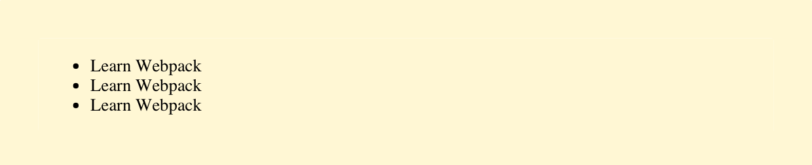
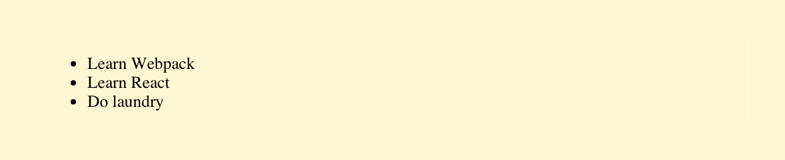
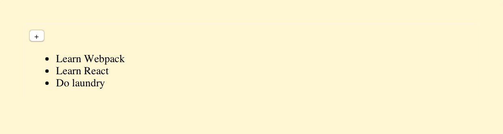
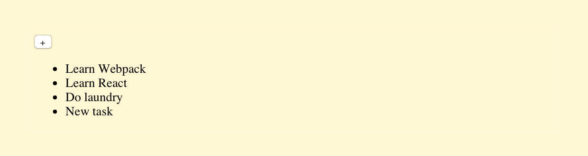
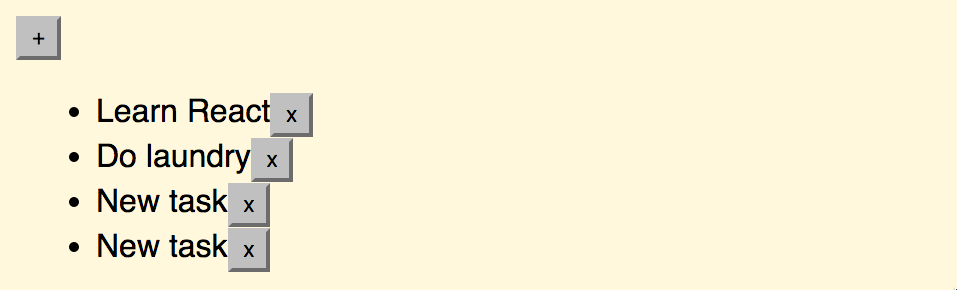
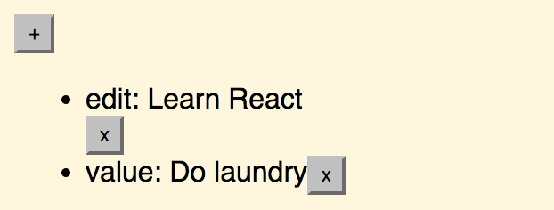
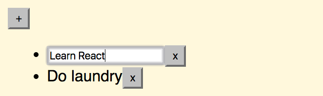
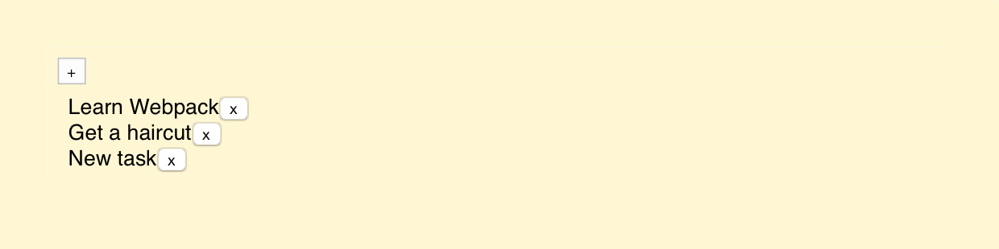
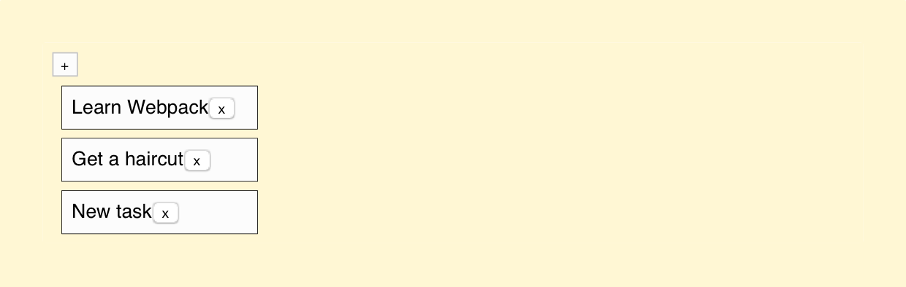
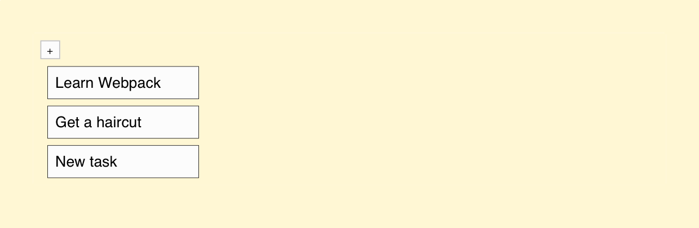

# Implementing a Basic Note Application

Given we have a nice development setup now, we can actually get some work done. Our goal here is to end up with a crude note taking application. It will have basic manipulation operations. We will grow our application from scratch and get into some trouble. This way you will understand why architectures such as Flux are needed.

## Initial Data Model

Often a good way to begin designing an application is to start with the data. We could model a list of notes as follows:

```javascript
[
  {
    id: '4a068c42-75b2-4ae2-bd0d-284b4abbb8f0',
    task: 'Learn Webpack'
  },
  {
    id: '4e81fc6e-bfb6-419b-93e5-0242fb6f3f6a',
    task: 'Learn React'
  },
  {
    id: '11bbffc8-5891-4b45-b9ea-5c99aadf870f',
    task: 'Do laundry'
  }
];
```

Each note is an object which will contain the data we need, including an `id` and a `task` we want to perform. Later on it is possible to extend this data definition to include things like the note color or the owner.

## On Ids

We could have skipped ids in our definition. This would become problematic as we grow our application, though. If you are referring to data based on array indices and the data changes, each reference has to change too. We can avoid that.

Normally the problem is solved by a back-end. As we don't have one yet, we'll need to improvise something. A standard known as [RFC4122](https://www.ietf.org/rfc/rfc4122.txt) allows us to generate unique ids. We'll be using a Node.js implementation known as *node-uuid*. Invoke

```bash
npm i node-uuid --save
```

at the project root to get it installed.

If you open up the Node.js CLI (`node`) and try following, you can see what kind of ids it outputs.

```javascript
> uuid = require('node-uuid')
{ [Function: v4]
  v1: [Function: v1],
  v4: [Circular],
  parse: [Function: parse],
  unparse: [Function: unparse],
  BufferClass: [Function: Array] }
> uuid.v4()
'1c8e7a12-0b4c-4f23-938c-00d7161f94fc'
```

`uuid.v4()` will help us to generate the ids we need for the purposes of this project. It is guaranteed return a unique id with a high probability. If you are interested in the math behind this, check out [the calculations at Wikipedia](https://en.wikipedia.org/wiki/Universally_unique_identifier#Random_UUID_probability_of_duplicates) for details. You'll see that the possibility for collisions is somewhat miniscule.

T> You can exit Node.js CLI by hitting **CTRL-D** once.

## Connecting Data with `App`

Next, we need to connect our data model with `App`. The simplest way to achieve that is to push the data directly to `render()` for now. This won't be efficient, but it will allow us to get started. The implementation below shows how this works out in React terms:

**app/components/App.jsx**

```javascript
import uuid from 'node-uuid';
import React from 'react';
import Note from './Note.jsx';

const notes = [
  {
    id: uuid.v4(),
    task: 'Learn Webpack'
  },
  {
    id: uuid.v4(),
    task: 'Learn React'
  },
  {
    id: uuid.v4(),
    task: 'Do laundry'
  }
];

export default class App extends React.Component {
  render() {
    return (
      <div>
        <ul>{notes.map(this.renderNote)}</ul>
      </div>
    );
  }
  renderNote(note) {
    return (
      <li key={`note${note.id}`}>
        <Note task={note.task} />
      </li>
    );
  }
}
```

We are using various important features of React in the snippet above. Understanding them is invaluable. I have annotated important parts below:

* `<ul>{notes.map(this.renderNote)}</ul>` - `{}`'s allow us to mix JavaScript syntax within JSX. `map` returns a list of `li` elements for React to render.
* ``<li key={`note${note.id}`}>`` - In order to tell React in which order to render the elements, we use the `key` property. It is important that this is unique or otherwise React won't be able to figure out the correct order in which to render. If not set, React will give a warning. See [Multiple Components](https://facebook.github.io/react/docs/multiple-components.html) for more information.

If you run the application now, you can see it almost works. There's a small glitch, but we'll fix that next.



T> If you want to attach comments to your JSX, just use `{/* no comments */}`.

## Fixing `Note`

The problem is that we haven't taken `task` prop into account at `Note`. In React terms *props* is a data structure that's passed to a component from outside. It is up to the component how it uses this data. In the code below I extract the value of a prop and render it.

**app/components/Note.jsx**

```javascript
import React from 'react';

export default class Note extends React.Component {
  render() {
    return <div>{this.props.task}</div>;
  }
}
```

If you check out the application now, you should see we're seeing results that are more like it. This is only the start, though. Our `App` is getting cramped. It feels like there's a component waiting to be extracted.



## Extracting `Notes`

If we keep on growing `App` like this we'll end up in trouble soon. Currently `App` deals with too many concerns. It shouldn't have to know what `Notes` look like. That's a perfect candidate for a component. As earlier, we'll want something that will accept a prop, say `items`, and is able to render them in a list. We already have logic for that in `App`. It needs to moved out.

T> Recognizing components is an important skill when working with React. There's small overhead to creating them and it allows you to model your problems in exact terms. At high level you will just worry about layout and connecting data. As you go lower in the architecture you start to see more concrete structures.

A good first step towards a neater `App` is to define `Notes`. It will rely on the rendering logic we already set up. We are just moving it to a component of its own. Specifically we'll want to perform `<Notes items={notes} />` at `render()` method of `App`. That's just nice.

You probably have the skills to implement `Notes` by now. Extract the logic from `App` and push it to a component of its own. Remember to attach `this.props.items` to the rendering logic. This way our interface works as expected. I've included complete implementation below for reference:

**app/components/Notes.jsx**

```javascript
import React from 'react';
import Note from './Note.jsx';

export default class Notes extends React.Component {
  render() {
    const notes = this.props.items;

    return <ul className='notes'>{notes.map(this.renderNote)}</ul>;
  }
  renderNote(note) {
    return (
      <li className='note' key={`note${note.id}`}>
        <Note task={note.task} />
      </li>
    );
  }
}
```

It is a good idea to attach some CSS classes to components to make it easier to style them. React provides other styling approaches beyond this. I've discussed them later in this book. There's no single right way to style and you'll have to adapt based on your preferences. In this case, we'll just focus on keeping it simple.

We also need to replace the old `App` logic to use our new component. You should remove the old rendering logic, import `Notes` and update `render()` to use it. Remember to pass `notes` through `items` prop and you might see something familiar. I have included the full solution below for completeness:

**app/components/App.jsx**

```javascript
import uuid from 'node-uuid';
import React from 'react';
import Note from './Note.jsx';
import Notes from './Notes.jsx';

const notes = [
  {
    id: uuid.v4(),
    task: 'Learn Webpack'
  },
  {
    id: uuid.v4(),
    task: 'Learn React'
  },
  {
    id: uuid.v4(),
    task: 'Do laundry'
  }
];

export default class App extends React.Component {
  render() {
    return (
      <div>
        <Notes items={notes} />
      </div>
    );
  }
}
```

Logically, we have exactly the same `App` as earlier. There's one great difference. Our application is more flexible. You could render multiple `Notes` with data of their own easily.

Even though we improved `render()` and reduced the amount of markup, it's still not neat. We can push the data to the `App`'s state. Besides making the code neater this will allow us to implement logic related to it.

## Pushing `notes` to the `App` `state`

As seen earlier React components can accept props. In addition, they may have a state of their own. This is something that exists within the component itself and can be modified. You can think of these two in terms of immutability. As you should not modify props you can treat them as immutable. The state, however, is mutable and you are free to alter it. In our case, pushing `notes` to the state makes sense. We'll want to tweak them through user interface.

In ES6's class syntax the initial state can be defined at the constructor. We'll assign the state we want to `this.state`. After that we can refer to it. The example below illustrates how to convert our notes into state.

**app/components/App.jsx**

```javascript
import uuid from 'node-uuid';
import React from 'react';
import Note from './Note.jsx';
import Notes from './Notes.jsx';

export default class App extends React.Component {
  constructor(props) {
    super(props);

    this.state = {
      notes: [
        {
          id: uuid.v4(),
          task: 'Learn Webpack'
        },
        {
          id: uuid.v4(),
          task: 'Learn React'
        },
        {
          id: uuid.v4(),
          task: 'Do laundry'
        }
      ]
    };
  }
  render() {
    const notes = this.state.notes;

    ...
  }
}
```

After this change our application works the same way as before. We have gained something in return, though. We can begin to alter the state.

T> In earlier versions of React you achieved the same with `getInitialState`. We're passing `props` to `super` by convention. It will work without, but it's a good standard to have. Calling `super` invokes the same method of the parent class and you see this kind of usage in object oriented programming often.

## Adding New Items to `Notes` list

Adding new items to the notes list is a good starting point. To get started, we could render a button element and attach a dummy `onClick` handler to it. We will grow the actual logic into that.

**app/components/App.jsx**

```javascript
...

export default class App extends React.Component {
  ...
  render() {
    const notes = this.state.notes;

    return (
      <div>
        <button className='add-note' onClick={this.addNote}>+</button>
        <Notes items={notes} />
      </div>
    );
  }
  addNote() {
    console.log('add note');
  }
}
```

If you click the plus button now, you should see something in your browser console. The next step is to connect this stub with our data model.



### Connecting `addNote` with Data Model

React provides one simple way to change the state, namely `this.setState(data, cb)`. It is an asynchronous method that updates `this.state` and triggers `render()` eventually. It accepts data and an optional callback. The callback is triggered after the process has completed.

It is best to think of state as immutable and alter it always through `setState`. In our case, adding a new note can be done through a `concat` operation as below.

**app/components/App.jsx**

```javascript
...

export default class App extends React.Component {
  constructor(props) {
    super(props);

    ...

    this.addNote = this.addNote.bind(this);
  }
  ...
  addNote() {
    this.setState({
      notes: this.state.notes.concat([{
        id: uuid.v4(),
        task: 'New task'
      }])
    });
  }
}
```

In case we were be operating with a back-end we would trigger a query here and capture id from response. Now it's enough to just generate an entry and a custom id.

If you hit the button a few times now, you should see new items. It might not be pretty yet, but it works.



In addition, to `this.setState` we had to set up a binding. Without it `this` of `addNote()` would point at the wrong context and wouldn't work. It is a little annoying, but necessary to bind therefore.

Using `bind` at `constructor` gives us a small performance benefit as opposed to binding at `render()`. I'll be using this convention unless it would take additional effort through lifecycle hooks. In the future [property initializers](https://facebook.github.io/react/blog/2015/01/27/react-v0.13.0-beta-1.html#es7-property-initializers) may solve this issue with a neat syntax.

T> Besides allowing you to set context [bind](https://developer.mozilla.org/en-US/docs/Web/JavaScript/Reference/Global_Objects/Function/bind) makes it possible to fix parameters to certain values. You will see an example of this shortly.

## Editing Notes

Our `Notes` list is almost useful now. We just need to implement editing and we're almost there. One simple way to achieve this is to detect click on a `Note` and then show an input containing its state. Then when the editing has been confirmed we can turn it back to normal.

This means we'll need to extend `Note` somehow and communicate possible changes to `App`. That way it knows to update the data model. Additionally, `Note` needs to keep track of its edit state. It has to show the correct element (div or input) based on that.

We can achieve these goals using a callback and a ternary expression. Here's a sample implementation of the idea:

**app/components/Note.jsx**

```javascript
import React from 'react';

export default class Note extends React.Component {
  constructor(props) {
    super(props);

    this.finishEdit = this.finishEdit.bind(this);
    this.checkEnter = this.checkEnter.bind(this);
    this.edit = this.edit.bind(this);
    this.renderEdit = this.renderEdit.bind(this);
    this.renderTask = this.renderTask.bind(this);

    this.state = {
      editing: false
    };
  }
  render() {
    const editing = this.state.editing;

    return (
      <div>
        {editing ? this.renderEdit() : this.renderTask()}
      </div>
    );
  }
  renderEdit() {
    return <input type='text'
      autoFocus={true}
      defaultValue={this.props.task}
      onBlur={this.finishEdit}
      onKeyPress={this.checkEnter} />;
  }
  renderTask() {
    return <div onClick={this.edit}>{this.props.task}</div>;
  }
  edit() {
    this.setState({
      editing: true
    });
  }
  checkEnter(e) {
    if(e.key === 'Enter') {
      this.finishEdit(e);
    }
  }
  finishEdit(e) {
    this.props.onEdit(e.target.value);

    this.setState({
      editing: false
    });
  }
}
```

If you try to edit a `Note` now, you will see an error (`this.props.onEdit is not a function`) at the console. We'll fix this shortly.

The rest of the code deals with events. If we click the component while it is in its initial state, we will enter the edit mode. If we confirm the editing, we hit the `onEdit` callback. As a result, we go back to the default state.

T> It is a good idea to name your callbacks using `on` prefix. This will allow you to distinguish them from other props and keep your code a little tidier.

### Adding `onEdit` Stub

Given we are currently dealing with the logic at `App`, we can deal with `onEdit` there as well. We will need to trigger this callback at `Note` and delegate the result to `App` level. The diagram below illustrates the idea:


A good first step towards this behavior is to create a stub. As `onEdit` is defined on `Note` level, we'll need to pass `onEdit` handler through `Notes`. So for the stub to work changes in two files are needed. Here's what it should look like for `App`.

**app/components/App.jsx**

```javascript
import uuid from 'node-uuid';
import React from 'react';
import Note from './Note.jsx';
import Notes from './Notes.jsx';

export default class App extends React.Component {
  constructor(props) {
    super(props);

    ...

    this.addNote = this.addNote.bind(this);
    this.editNote = this.editNote.bind(this);
  }
  render() {
    const notes = this.state.notes;

    return (
      <div>
        <button className='add-note' onClick={this.addNote}>+</button>
        <Notes items={notes} onEdit={this.editNote} />
      </div>
    );
  }
  ...
  editNote(noteId, task) {
    console.log('note edited', noteId, task);
  }
}
```

The idea is that `Notes` will return our callback the id of the note being modified and the new state of the task. We'll need to use this data soon in order to patch the state.

We also need to make `Notes` work according to this idea. It will `bind` the id of the note in question. When the callback is triggered the remaining parameter receives a value and the callback gets called.

**app/components/Notes.jsx**

```javascript
import React from 'react';
import Note from './Note.jsx';

export default class Notes extends React.Component {
  constructor(props) {
    super(props);

    this.renderNote = this.renderNote.bind(this);
  }
  render() {
    const notes = this.props.items;

    return <ul className='notes'>{notes.map(this.renderNote)}</ul>;
  }
  renderNote(note) {
    return (
      <li className='note' key={`note${note.id}`}>
        <Note
          task={note.task}
          onEdit={this.props.onEdit.bind(null, note.id)} />
      </li>
    );
  }
}
```

If you edit a `Note` now, you should see a print at the console.

We are missing one final bit, the actual logic. Our state consists of `Notes` each of which has an id (string) and a task (string) attached to it. Our callback receives both of these. In order to edit a `Note` it should find the `Note` to edit and patch its task using the new data.

### Understanding `findIndex`

We'll be using an ES6 function known as [findIndex](https://developer.mozilla.org/en-US/docs/Web/JavaScript/Reference/Global_Objects/Array/findIndex). It accepts an array and a callback. The function will return either -1 (no match) or index (match) depending on the result.

Babel provides an easy way to polyfill this feature using `import 'babel-core/polyfill';`. The problem is that it bloats our final bundle somewhat as it enables all [core-js](https://github.com/zloirock/core-js) features. As we need just one shim, we'll be using a specific shim for this instead. Hit

```bash
npm i array.prototype.findindex --save
```

You can see how it behaves through Node.js cli. Here's a sample session:

```javascript
> require('array.prototype.findindex')
{}
> a = [12, 412, 30]
[ 12, 412, 30 ]
> a.findIndex(function(v) {return v === 12;})
0
> a.findIndex(function(v) {return v === 121;})
-1
```

T> [es5-shim](https://www.npmjs.com/package/es5-shim), [es6-shim](https://www.npmjs.com/package/es6-shim) and [es7-shim](https://www.npmjs.com/package/es7-shim) are good alternatives to `core-js`. At the moment they don't allow you to import the exact shims you need in a granular way. That said, using a whole library at once can be worth the convenience.

We also need to attach the polyfill to our application.

**app/main.jsx**

```
import 'array.prototype.findindex';
...
```

After this you can use `findIndex` against arrays at your code. Note that this will bloat our final bundle a tiny bit (around 4 kB), but the convenience is worth it.

### Implementing `onEdit` Logic

The only thing that remains is gluing this all together. We'll need to take the data and find index based on which to alter. Finally, we need to modify and commit it to the component state through `setState`.

**app/components/App.jsx**

```javascript
import uuid from 'node-uuid';
import React from 'react';
import Note from './Note.jsx';
import Notes from './Notes.jsx';

export default class App extends React.Component {
  constructor(props) {
    ...

    this.findNote = this.findNote.bind(this);
    this.addNote = this.addNote.bind(this);
    this.editNote = this.editNote.bind(this);
  }
  editNote(id, task) {
    let notes = this.state.notes;
    const noteIndex = this.findNote(id);

    if(noteIndex < 0) {
      return;
    }

    notes[noteIndex].task = task;

    this.setState({notes});
  }
  findNote(id) {
    const notes = this.state.notes;
    const noteIndex = notes.findIndex((note) => note.id === id);

    if(noteIndex < 0) {
      console.warn('Failed to find note', notes, id);
    }

    return noteIndex;
  }
}
```

If you try to edit a `Note` now, the modification should stick. The same idea can be used to implement a lot of functionality and this is a pattern you will see a lot.



## Removing `Notes`

We are still missing one vital functionality. It would be nice to be able to delete notes. We could implement a button per `Note` and trigger the logic using that. It will look a little rough initially, but we will style it later.

As before we'll need to define some logic on `App` level. Deleting a note can be achieved by first looking for a `Note` to remove based on id. After we know which `Note` to remove we can construct a new state without it.

**app/components/App.jsx**

```javascript
import uuid from 'node-uuid';
import React from 'react';
import Note from './Note.jsx';
import Notes from './Notes.jsx';

export default class App extends React.Component {
  constructor(props) {
    ...
    this.editNote = this.editNote.bind(this);
    this.deleteNote = this.deleteNote.bind(this);
  }
  render() {
    const notes = this.state.notes;

    return (
      <div>
        <button className='add-note' onClick={this.addNote}>+</button>
        <Notes items={notes}
          onEdit={this.editNote} onDelete={this.deleteNote} />
      </div>
    );
  }
  deleteNote(id) {
    const notes = this.state.notes;
    const noteIndex = this.findNote(id);

    if(noteIndex < 0) {
      return;
    }

    this.setState({
      notes: notes.slice(0, noteIndex).concat(notes.slice(noteIndex + 1))
    });
  }
  ...
}
```

In addition to logic we'll need to trigger `onDelete` logic at `Note` level. The idea is the same as before. We'll bind the id of the `Note` at `Notes`. A `Note` will simply trigger the callback when the user triggers the behavior.

**app/components/Notes.jsx**

```javascript
export default class Notes extends React.Component {
  ...
  renderNote(note) {
    return (
      <li className='note' key={`note${note.id}`}>
        <Note
          task={note.task}
          onEdit={this.props.onEdit.bind(null, note.id)}
          onDelete={this.props.onDelete.bind(null, note.id)} />
      </li>
    );
  }
}
```

In order to invoke the previous `onDelete` callback we need to connect it with `onClick` of `Note`. If the callback doesn't exist, it makes sense to avoid rendering the delete button. An alternative way to solve this would be to push it to a component of its own.

**app/components/Note.jsx**

```javascript
...

export default class Note extends React.Component {
  ...
  renderTask() {
    const onDelete = this.props.onDelete;

    return (
      <div onClick={this.edit}>
        <span className='task'>{this.props.task}</span>
        {onDelete ? this.renderDelete() : null }
      </div>
    );
  }
  renderDelete() {
    return <button className='delete' onClick={this.props.onDelete}>x</button>;
  }
  ...
```

After these changes you should be able to delete notes as you like.



We have a fairly well working little application now. We can create, update and delete `Notes` now. During this process we learned something about props and state. There's more than that to React, though.

T> Now deletion is sort of blunt. One interesting way to develop this further would be to add confirmation. One simple way to achieve this would be to show yes/no buttons before performing the action. The logic would be more or less the same as for editing. This behavior could be extracted into a component of its own.

## Styling Notes

Aesthetically our current application is very barebones. As pretty applications are more fun to use we can do a little something about that. The first step is to get rid of that horrible *serif* font.

**app/main.css**

```css
body {
  background: cornsilk;
  font-family: sans-serif;
}
```

Looking a little nicer now:



A good next step would be to constrain `Notes` container a little and get rid of those list bullets.

**app/main.css**

```css
...

.add-note {
  background-color: #fdfdfd;
  border: 1px solid #ccc;
}

.notes {
  margin: 0.5em;
  padding-left: 0;

  max-width: 10em;
  list-style: none;
}
```

Removing bullets helps:



To make individual `Notes` stand out we can apply a couple of rules.

**app/main.css**

```css
...

.note {
  margin-bottom: 0.5em;
  padding: 0.5em;

  background-color: #fdfdfd;
  box-shadow: 0 0 0.3em 0.03em rgba(0, 0, 0, 0.3);
}
.note:hover {
  box-shadow: 0 0 0.3em 0.03em rgba(0, 0, 0, 0.7);

  transition: 0.6s;
}

.note .task {
  /* force to use inline-block so that it gets minimum height */
  display: inline-block;
}
```

Now notes stand out a bit:



I animated `Note` shadow in the process. This way the user gets a better indication of what `Note` is being hovered upon. This won't work on touch based interfaces, but it's a nice touch for the desktop.

Finally, we should make those delete buttons stand out less. One way to achieve this is to hide them by default and show them on hover. The gotcha is that deletion won't work on touch, but we can live with that.

**app/main.css**

```css
...

.note .delete {
  float: right;

  padding: 0;

  background-color: #fdfdfd;
  border: none;
  cursor: pointer;
  cursor: hand;

  visibility: hidden;
}
.note:hover .delete {
  visibility: visible;
}
```

No more those pesky deletion buttons:



After these few steps we have an application that doesn't look that bad. We'll be improving its outlook as we add functionality, but at least it's something.

## Understanding React Components

Understanding how props and state work it is important. Component lifecycle is the third bigger concept you'll want to understand well. We already touched it above, but it's a good idea to understand it in more detail. You can achieve most tasks in React by applying these concepts throughout your application.

To quote [the official documentation](https://facebook.github.io/react/docs/component-specs.html) React provides the following `React.createClass` specific component specifications:

* `displayName` - It is preferable to set `displayName` as that will improve debug information. For ES6 classes this is derived automatically based on the class name.
* `getInitialState()` - In class based approach the same can be achieved through `constructor`.
* `getDefaultProps()` - In classes you can set these in `constructor`.
* `propTypes` - As seen above, you can use Flow to deal with prop types. In `React.createClass` you would build a complex looking declaration as seen in [the propType documentation](https://facebook.github.io/react/docs/reusable-components.html).
* `mixins` - `mixins` contains an array of mixins to apply to component.
* `statics` - `statics` contains static properties and method for a component. In ES6 you would assign them to the class like below:

```javascript
class Note {
  render() {
    ...
  }
}
Note.willTransitionTo = () => {...};

export default Note;
```

Some libraries such as `react-dnd` rely on static methods to provide transition hooks. They allow you to control what happens when a component is shown or hidden. By definition statics are available through the class itself.

Both component types support `render()`. As seen above, this is the workhorse of React. It describes what the component should look like. In case you don't want to render anything return either `null` or `false`.

In addition, React provides the following lifecycle hooks:

* `componentWillMount()` gets triggered once before any rendering. One way to use it would be to load data asynchronously there and force rendering through `setState`.
* `componentDidMount()` gets triggered after initial rendering. You have access to the DOM here. You could use this hook to wrap a jQuery plugin within a component for instance.
* `componentWillReceiveProps(object nextProps)` triggers when the component receives new props. You could, for instance, modify your component state based on the received props.
* `shouldComponentUpdate(object nextProps, object nextState)` allows you to optimize the rendering. If you check the props and state and see that there's no need to update, return `false`.
* `componentWillUpdate(object nextProps, object nextState)` gets triggered after `shouldComponentUpdate` and before `render()`. It is not possible to use `setState` here, but you can set class properties for instance.
* `componentDidUpdate` is triggered after rendering. You can modify the DOM here. This can be useful for adapting other code to work with React.
* `componentWillUnmount` is triggered just before a component is unmounted from the DOM. This is the ideal place to perform cleanup (e.g., remove running timers, custom DOM elements and so on).

## React Component Conventions

I prefer to have the `constructor` first, followed by lifecycle hooks, `render()` and finally methods used by `render()`. I like this top-down approach as it makes it straightforward to follow code. Some prefer to put the methods used by `render()` before it. There are also various naming conventions. It is possible to use `_` prefix for event handlers for instance.

In the end you will have to find conventions you like and that work the best for you. I go more detail in this topic at the linting chapter as I introduce various code quality related tools. It is possible to enforce coding style to some extent for example.

This can be useful in a team environment. It decreases the amount of friction when working on code written by others. Even on personal projects having some tools to check out things for you can be useful. It lessens the amount and severity of mistakes.

## Conclusion

You can get quite far just with vanilla React. The problem is that we are starting to mix data related concerns and logic with our View components. We'll improve the architecture of our application by introducing Flux to it.
