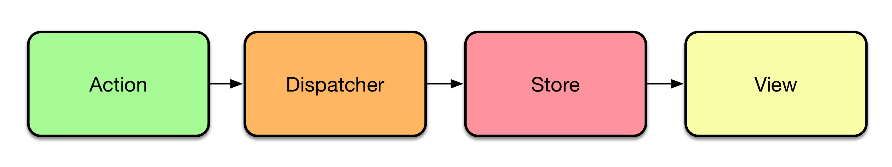
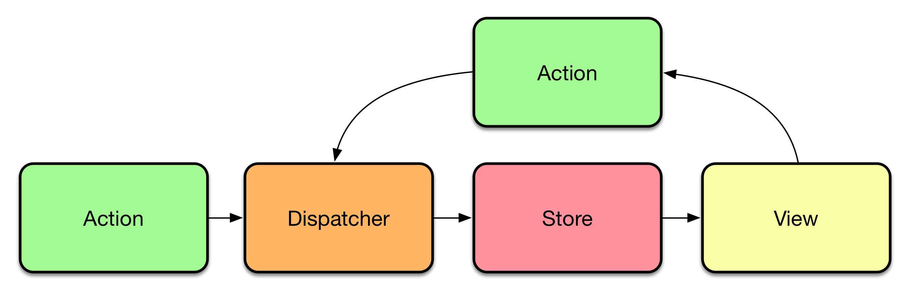

# React and Flux

You can get pretty far by keeping everything in components. Eventually that will become painful. [Flux application architecture](https://facebook.github.io/flux/docs/overview.html) helps to bring clarity to our React applications.

Flux will allow us to separate data and application state from our views. This helps us to keep them clean and the application maintainable. Flux was designed with large teams in mind. As a result, you might find it quite verbose. This comes with great advantages, though, as it can be straightforward to work with.

## Introduction to Flux



So far we've been dealing only with views. Flux architecture introduces a couple of new concepts to the mix. These are actions, dispatcher, and stores. Flux implements unidirectional flow in contrast to popular frameworks such as Angular or Ember. Even though two-directional bindings can be convenient, they come with a cost. It can be hard to deduce what's going on and why.

Flux isn't entirely simple to understand as there are many concepts to worry about. In our case, we will model `NoteActions` and `NoteModel`. `NoteActions` provide concrete operations we can perform over our data. For instance, we can have `NoteActions.create({task: 'Learn React'})`.

When we trigger the action, the dispatcher will get notified. The dispatcher will be able to deal with possible store dependencies. It is possible that certain action needs to happen before another. Dispatcher allows us to achieve this.

At the simplest level, actions can just pass the message to dispatcher as is. They can also trigger asynchronous queries and hit dispatcher based on the result eventually. This allows us to deal with received data and possible errors.

Once the dispatcher has dealt with the action, stores that are listening to it get triggered. In our case, `NoteStore` gets notified. As a result, it will be able to update its internal state. After doing this it will notify possible listeners of the new state.

This completes the basic unidirectional, yet linear, process flow of Flux. Usually, though, the unidirectional process has a cyclical flow and it doesn't necessarily end. The following diagram illustrates a more common flow. It is the same idea again, but with the addition of a returning cycle. Eventually the components depending on our store data become refreshed through this looping process.

This sounds like a lot of steps for achieving something simple as creating a new `Note`. The approach does come with its benefits. Given the flow is always in a single direction, it is easy to trace and debug. If there's something wrong, it's somewhere within the cycle.



### Advantages of Flux

Even though this sounds a little complicated, the arrangement gives our application flexibility. We can, for instance, implement API communication, caching, and i18n outside of our views. This way they stay clean of logic while keeping the application easier to understand.

Implementing Flux architecture in your application will actually increase the amount of code somewhat. It is important to understand: minimizing the amount of code written isn't the goal of Flux. It has been designed to allow productivity across larger teams. You could say, "explicit is better than implicit".

### Which Flux Implementation to Use?

The library situation is constantly changing. There is no single right way to interpret the architecture. You will find implementations that fit different tastes. [voronianski/flux-comparison](https://github.com/voronianski/flux-comparison) provides a nice comparison between some of the more popular ones.

When choosing a library it comes down to your own personal preferences. You will have to consider factors such as API, features, documentation, and support. Starting with one of the more popular alternatives can be a good idea. As you begin to understand the architecture, you are able to make choices that serve you better.

## Porting to Alt


In this chapter we'll be using a library known as [Alt](http://alt.js.org/). It is a flexible, full-featured implementation that has been designed with isomorphic rendering in mind.

In Alt you'll deal with actions and stores. The dispatcher is hidden, but you will still have access to it if needed. Compared to other implementations Alt hides a lot of boilerplate. There are special features to allow you to save and restore the application state. This is handy for implementing persistency and isomorphic rendering.

### Setting Up an Alt Instance

Everything in Alt begins from an Alt instance. It keeps track of actions and stores and keeps communication going on. To get started, we should add Alt to our project:

```bash
npm i alt --save
```

To keep things simple, we'll be treating all Alt components as a [singleton](https://en.wikipedia.org/wiki/Singleton_pattern). With this pattern, we reuse the same instance within the whole application. To achieve this we can push it to a module of its own and then refer to that from everywhere. Set it up as follows:

**app/libs/alt.js**

```javascript
import Alt from 'alt';
//import chromeDebug from 'alt/utils/chromeDebug';

const alt = new Alt();
//chromeDebug(alt);

export default alt;
```

Webpack caches the modules so the next time you import Alt, it will return the same instance again.

T> There is a Chrome plugin known as [alt-devtool](https://github.com/goatslacker/alt-devtool). After it is installed, you can connect to Alt by uncommenting the related lines above. You can use it to debug the state of your stores, search, and travel in time.

### Defining CRUD API for Notes

Next we'll need to define a basic API for operating over the Note data. To keep this simple, we can CRUD (Create, Read, Update, Delete) it. Given Read is implicit, we won't be needing that. We can model the rest as actions, though. Alt provides a shorthand known as `generateActions`. We can use it like this:

**app/actions/NoteActions.js**

```javascript
import alt from '../libs/alt';

export default alt.generateActions('create', 'update', 'delete');
```

## Defining a Store for `Notes`

A store is a single source of truth for a part of your application state. In this case, we need one to maintain the state of the notes. We will connect all the actions we defined above using the `bindActions` function.

We have the logic we need for our store already at `App`. We will move that logic to `NoteStore`.

### Setting Up a Skeleton

As a first step, we can set up a skeleton for our store. We can fill in the methods we need after that. Alt uses standard ES6 classes, so it's the same syntax as we saw earlier with React components. Here's a starting point:

**app/stores/NoteStore.js**

```javascript
import uuid from 'node-uuid';
import alt from '../libs/alt';
import NoteActions from '../actions/NoteActions';

class NoteStore {
  constructor() {
    this.bindActions(NoteActions);

    this.notes = [];
  }
  create(note) {

  }
  update({id, task}) {

  }
  delete(id) {

  }
}

export default alt.createStore(NoteStore, 'NoteStore');
```

We call `bindActions` to map each action to a method by name. We trigger the appropriate logic at each method based on that. Finally we connect the store with Alt using `alt.createStore`.

Note that assigning a label to a store (`NoteStore` in this case) isn't required. It is a good practice as it protects the code against minification and possible collisions. These labels become important when we persist the data.

### Implementing `create`

Compared to the earlier logic, `create` will generate an id for a `Note` automatically. This is a detail that can be hidden within the store:

**app/stores/NoteStore.js**

```javascript
import uuid from 'node-uuid';
import alt from '../libs/alt';
import NoteActions from '../actions/NoteActions';

class NoteStore {
  constructor() {
    ...
  }
  create(note) {
    const notes = this.notes;

    note.id = uuid.v4();

    this.setState({
      notes: notes.concat(note)
    });
  }
  ...
}

export default alt.createStore(NoteStore, 'NoteStore');
```

To keep the implementation clean, we are using `this.setState`. It is a feature of Alt that allows us to signify that we are going to alter the store state. Alt will signal the change to possible listeners.

### Implementing `update`

`update` follows the earlier logic apart from some renaming. Most importantly we commit the new state through `this.setState`:

**app/stores/NoteStore.js**

```javascript
...

class NoteStore {
  ...
  update({id, task}) {
    const notes = this.notes.map((note) => {
      if(note.id === id) {
        note.task = task;
      }

      return note;
    });

    this.setState({notes});
  }
  delete(id) {

  }
}

export default alt.createStore(NoteStore, 'NoteStore');
```

We have one final operation left, `delete`.

T> `{notes}` is known as a an ES6 feature known as [property shorthand](https://developer.mozilla.org/en-US/docs/Web/JavaScript/Reference/Operators/Object_initializer). This is equivalent to `{notes: notes}`.

### Implementing `delete`

`delete` is straightforward. Seek and destroy, as earlier, and remember to commit the change:

**app/stores/NoteStore.js**

```javascript
...

class NoteStore {
  ...
  delete(id) {
    this.setState({
      notes: this.notes.filter((note) => note.id !== id)
    });
  }
}

export default alt.createStore(NoteStore, 'NoteStore');
```

Instead of slicing and concatenating data, it would be possible to operate directly on it. For example a mutable variant such as `this.notes.splice(targetId, 1)` would work. We could also use a shorthand, such as `[...notes.slice(0, noteIndex), ...notes.slice(noteIndex + 1)]`. The exact solution depends on your preferences. I prefer to avoid mutable solutions (i.e., `splice`) myself.

It is recommended that you use `setState` with Alt to keep things clean and easy to understand. Manipulating `this.notes` directly would work but that would miss the intent. `setState` provides a nice analogue to the way React works so it's worth using.

We have almost integrated Flux with our application now. We have a set of actions that provide an API for manipulating `Notes` data. We also have a store for actual data manipulation. We are missing one final bit, integration with our view. It will have to listen to the store and be able to trigger actions to complete the cycle.

T> The current implementation is naïve in that it doesn't validate parameters in any way. It would be a very good idea to validate the object shape to avoid incidents during development. [Flow](http://flowtype.org/) based gradual typing provides one way to do this. Alternatively you could write nice tests. That's a good idea regardless.

## Gluing It All Together

Gluing this all together is a little complicated as there are multiple concerns to take care of. Dealing with actions is going to be easy. For instance, to create a Note, we would need to trigger `NoteActions.create({task: 'New task'})`. That would cause the associated store to change and, as a result, all the components listening to it.

Our `NoteStore` provides two methods in particular that are going to be useful. These are `NoteStore.listen` and `NoteStore.unlisten`. They will allow views to subscribe to the state changes.

As you might remember from the earlier chapters, React provides a set of lifecycle hooks. We can subscribe to `NoteStore` within our view at `componentDidMount` and `componentWillUnmount`. By unsubscribing, we avoid possible memory leaks.

Based on these ideas we can connect `App` with `NoteStore` and `NoteActions`:

**app/components/App.jsx**

```javascript
import React from 'react';
import Notes from './Notes.jsx';
import NoteActions from '../actions/NoteActions';
import NoteStore from '../stores/NoteStore';

export default class App extends React.Component {
  constructor(props) {
    super(props);

    this.state = NoteStore.getState();
  }
  componentDidMount() {
    NoteStore.listen(this.storeChanged);
  }
  componentWillUnmount() {
    NoteStore.unlisten(this.storeChanged);
  }
  storeChanged = (state) => {
    // Without a property initializer `this` wouldn't
    // point at the right context (defaults to `window`).
    this.setState(state);
  }
  render() {
    const notes = this.state.notes;

    return (
      <div>
        <button className="add-note" onClick={this.addNote}>+</button>
        <Notes items={notes}
          onEdit={this.editNote} onDelete={this.deleteNote} />
      </div>
    );
  }
  addNote() {
    NoteActions.create({task: 'New task'});
  }
  editNote(id, task) {
    NoteActions.update({id, task});
  }
  deleteNote(id) {
    NoteActions.delete(id);
  }
}
```

As we alter `NoteStore` through actions, this leads to a cascade that causes our `App` state to update through `setState`. This in turn will cause the component to `render`. That's Flux's unidirectional flow in practice.

We actually have more code now than before, but that's okay. `App` is a little neater and it's going to be easier to develop as we'll soon see. Most importantly we have managed to implement the Flux architecture for our application.

### What's the Point?

Even though integrating Alt took a lot of effort, it was not all in vain. Consider the following questions:

1. Suppose we wanted to persist the notes within `localStorage`. Where would you implement that? It would be natural to plug that into our `NoteStore`. Alternatively we could do something more generic as we'll be doing next.
2. What if we had many components relying on the data? We would just consume `NoteStore` and display it, however we want.
3. What if we had many, separate Note lists for different types of tasks? We could set up another store for tracking these lists. That store could refer to actual Notes by id. We'll do something like this in the next chapter as we generalize the approach.

This is what makes Flux a strong architecture when used with React. It isn't hard to find answers to questions like these. Even though there is more code, it is easier to reason about. Given we are dealing with a unidirectional flow we have something that is simple to debug and test.

## Implementing Persistency over `localStorage`

We will modify our implementation of `NoteStore` to persist the data on change. This way we don't lose our data after a refresh. One way to achieve this is to use [localStorage](https://developer.mozilla.org/en/docs/Web/API/Window/localStorage). It is a well supported feature that allows you to persist data to the browser.

### Understanding `localStorage`

`localStorage` has a sibling known as `sessionStorage`. Whereas `sessionStorage` loses its data when the browser is closed, `localStorage` retains its data. They both share [the same API](https://developer.mozilla.org/en-US/docs/Web/API/Web_Storage_API/Using_the_Web_Storage_API) as discussed below:

* `storage.getItem(k)` - Returns the stored string value for the given key.
* `storage.removeItem(k)` - Removes the data matching the key.
* `storage.setItem(k, v)` - Stores the given value using the given key.
* `storage.clear()` - Empties the storage contents.

Note that it is convenient to operate on the API using your browser developer tools. For instance, in Chrome you can see the state of the storages through the *Resources* tab. *Console* tab allows you to perform direct operations on the data. You can even use `storage.key` and `storage.key = 'value'` shorthands for quick modifications.

`localStorage` and `sessionStorage` can use up to 10 MB of data combined. Even though they are well supported, there are certain corner cases with interesting failures. These include running out of memory in Internet Explorer (fails silently) and failing altogether in Safari's private mode. It is possible to work around these glitches, though.

T> You can support Safari in private mode by trying to write into `localStorage` first. If that fails, you can use Safari's in-memory store instead, or just let the user know about the situation. See [Stack Overflow](https://stackoverflow.com/questions/14555347/html5-localstorage-error-with-safari-quota-exceeded-err-dom-exception-22-an) for details.

### Implementing a Wrapper for `localStorage`

To keep things simple and manageable, we can implement a little wrapper for `storage`. It will wrap all of these complexities. The API expects strings.

As objects are convenient, we'll use `JSON.parse` and `JSON.stringify` for serialization. We need just `storage.get(k)` and `storage.set(k, v)` as seen in the implementation below:

**app/libs/storage.js**

```javascript
export default {
  get: function(k) {
    try {
      return JSON.parse(localStorage.getItem(k));
    }
    catch(e) {
      return null;
    }
  },
  set: function(k, v) {
    localStorage.setItem(k, JSON.stringify(v));
  }
};
```

The implementation could be generalized further. You could convert it into a factory (`(storage) => {...}`) and make it possible to swap the storage. Now we are stuck with `localStorage` unless we change the code.

T> We're operating with `localStorage` directly to keep the implementation simple. An alternative would be to use [localForage](https://github.com/mozilla/localForage) to hide all the complexity. You could even integrate it behind our interface.

### Persisting Application Using `FinalStore`

Besides this little utility, we'll need to adapt our application to use it. Alt provides a built-in store called `FinalStore` which is perfect for this purpose. We can persist the entire state of our application using `FinalStore`, bootstrapping, and snapshotting. `FinalStore` is a store that listens to all existing stores. Every time some store changes, `FinalStore` will know about it. This makes it ideal for persistency.

We can take a snapshot of the entire app state and push it to `localStorage` every time `FinalStore` changes. That solves one part of the problem. Bootstrapping solves the remaining part as `alt.bootstrap` allows us to set state of the all stores. In our case, we'll fetch the data from `localStorage` and invoke it to populate our stores. This is handy for other cases as well. The data can come from elsewhere, through a WebSocket for instance.

T> An alternative way would be to take a snapshot only when the window gets closed. There's a Window level `beforeunload` hook that could be used. The problem with this approach is that it is brittle. What if something unexpected happens and the hook doesn't get triggered for some reason? You'll lose data.

In order to integrate this idea to our application we will need to implement a little module to manage it. We take the possible initial data into account there and trigger the new logic.

*app/libs/persist.js*  does the hard part. It will set up a `FinalStore`, deal with bootstrapping (restore data) and snapshotting (save data). I have included an escape hatch in the form of the `debug` flag. If it is set, the data won't get saved to `localStorage`. The reasoning is that by doing this, you can set the flag (`localStorage.setItem('debug', 'true')`), hit `localStorage.clear()` and refresh the browser to get a clean slate. The implementation below illustrates these ideas:

**app/libs/persist.js**

```javascript
import makeFinalStore from 'alt/utils/makeFinalStore';

export default function(alt, storage, storeName) {
  const finalStore = makeFinalStore(alt);

  try {
    alt.bootstrap(storage.get(storeName));
  }
  catch(e) {
    console.error('Failed to bootstrap data', e);
  }

  finalStore.listen(() => {
    if(!storage.get('debug')) {
      storage.set(storeName, alt.takeSnapshot());
    }
  });
}
```

Finally, we need to trigger the persistency logic at initialization. We will need to pass the relevant data to it (Alt instance, storage, storage name) and off we go.

**app/index.jsx**

```javascript
...
import alt from './libs/alt';
import storage from './libs/storage';
import persist from './libs/persist';

main();

function main() {
  persist(alt, storage, 'app');

  ...
}
```

If you try refreshing the browser now, the application should retain its state. The solution should scale with minimal effort if we add more stores to the system. Integrating a real back-end wouldn't be a problem. There are hooks in place for that now.

You could, for instance, pass the initial payload as a part of your HTML (isomorphic rendering), load it up, and then persist the data to the back-end. You have a great deal of control over how to do this, and you can use `localStorage` as a backup if you want.

W> Our `persist` implementation isn't without its flaws. It is easy to end up in a situation where `localStorage` contains invalid data due to changes made to the data model. This brings you to the world of database schemas and migrations. There are no easy solutions. Regardless, this is something to keep in mind when developing something more sophisticated. The lesson here is that the more you inject state to your application, the more complicated it gets.

## Using the `AltContainer`

The [AltContainer](http://alt.js.org/docs/components/altContainer/) wrapper allows us to simplify connection logic greatly and cut down the amount of logic needed. To get started, install it using:

```bash
npm i alt-container --save
```

The implementation below illustrates how to bind it all together. Note how much code we can remove!

**app/components/App.jsx**

```javascript
import AltContainer from 'alt-container';
import React from 'react';
import Notes from './Notes.jsx';
import NoteActions from '../actions/NoteActions';
import NoteStore from '../stores/NoteStore';

export default class App extends React.Component {
  render() {
    return (
      <div>
        <button className="add-note" onClick={this.addNote}>+</button>
        <AltContainer
          stores={[NoteStore]}
          inject={{
            items: () => NoteStore.getState().notes
          }}
        >
          <Notes onEdit={this.editNote} onDelete={this.deleteNote} />
        </AltContainer>
      </div>
    );
  }
  ...
}
```

The `AltContainer` allows us to bind data to its immediate children. In this case it injects the `items` property in to `Notes`. The pattern allows us to set up arbitrary connections to multiple stores and manage them. You can find another possible approach at the appendix about decorators.

Integrating the `AltContainer` tied this component to Alt. If you wanted something forward-looking, you could push it into a component of your own. That facade would hide Alt and allow you to replace it with something else later on.

## Dispatching in Alt

Even though you can get far without ever using Flux dispatcher, it can be useful to know something about it. Alt provides two ways to use it. If you want to log everything that goes through your `alt` instance, you can use a snippet such as `alt.dispatcher.register(console.log.bind(console))`. Alternatively you could trigger `this.dispatcher.register(...)` at a store constructor. These mechanisms allow you to implement effective logging.

## Relay?

Facebook's [Relay](https://facebook.github.io/react/blog/2015/02/20/introducing-relay-and-graphql.html) improves on the data fetching department. It allows you to push data requirements to the view level. It can be used standalone or with Flux depending on your needs.

Given it's still largely untested technology, we won't be covering it in this book yet. Relay comes with special requirements of its own (GraphQL compatible API). Only time will tell how it gets adopted by the community.

## Conclusion

In this chapter you saw how to port our simple application to use Flux architecture. In the process we learned about basic concepts of Flux. Now we are ready to start adding more functionality to our application.
