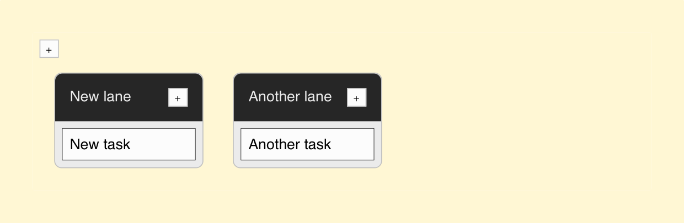
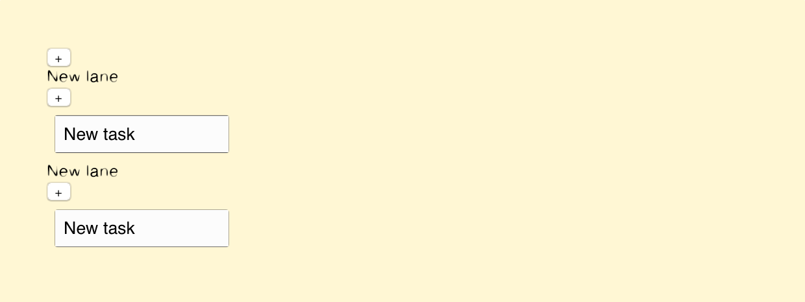
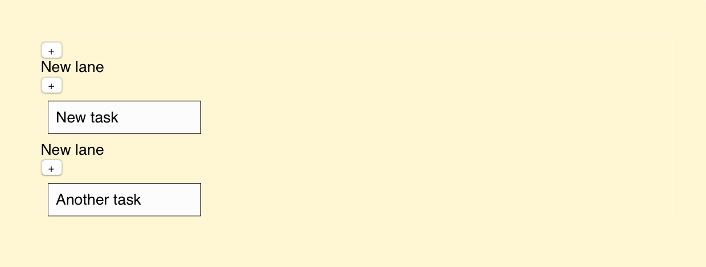
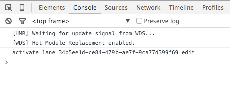

# From Notes to Kanban



So far we have managed to set up a nice little development environment. We have developed an application for keeping track of notes in `localStorage`. We still have work to do to turn this into a real Kanban as pictured above. Most importantly our system is missing the concept of `Lane`.

A `Lane` is something that should be able to contain many `Notes` within itself and track their order. One way to model this is simply to make a `Lane` point at `Notes` through an array of `Note` ids. This relation could be reversed. A `Note` could point at a `Lane` using an id and maintain information about its position within a `Lane`. In this case we are going to stick with the former design as that works well with re-ordering later on.

## Extracting `Lanes`

As earlier, we can use the same idea of two components here. There will be a component for the higher level (i.e., `Lanes`) and for the lower level (i.e., `Lane`). The higher level component will deal with lane ordering. A `Lane` will render itself (i.e., name and `Notes`) and have basic manipulation operations.

Just as with `Notes`, we are going to need a set of actions. For now it is enough if we can just create new lanes so we can create a corresponding action for that as below:

**app/actions/LaneActions.js**

```javascript
import alt from '../libs/alt';

export default alt.generateActions('create');
```

In addition, we are going to need a `LaneStore` and a method matching to `create`. The idea is pretty much the same as for `NoteStore` earlier. `create` will concatenate a new lane to the list of lanes. After that the change will propagate to the listeners (i.e., `FinalStore` and components).

**app/stores/LaneStore.js**

```javascript
import uuid from 'node-uuid';
import alt from '../libs/alt';
import LaneActions from '../actions/LaneActions';

class LaneStore {
  constructor() {
    this.bindActions(LaneActions);

    this.lanes = [];
  }
  create(lane) {
    const lanes = this.lanes;

    lane.id = uuid.v4();
    lane.notes = lane.notes || [];

    this.setState({
      lanes: lanes.concat(lane)
    });
  }
}

export default alt.createStore(LaneStore, 'LaneStore');
```

We are also going to need a stub for `Lanes`. We will expand this later. For now we just want something simple to show up.

**app/components/Lanes.jsx**

```javascript
import React from 'react';

export default class Lanes extends React.Component {
  render() {
    return (
      <div className="lanes">
        lanes should go here
      </div>
    );
  }
}
```

Next we need to make room for `Lanes` at `App`. We will simply replace `Notes` references with `Lanes`, set up actions, and store as needed:

**app/components/App.jsx**

```javascript
import AltContainer from 'alt-container';
import React from 'react';
import Lanes from './Lanes.jsx';
import LaneActions from '../actions/LaneActions';
import LaneStore from '../stores/LaneStore';

export default class App extends React.Component {
  render() {
    return (
      <div>
        <button className="add-lane" onClick={this.addItem}>+</button>
        <AltContainer
          stores={[LaneStore]}
          inject={{
            items: () => LaneStore.getState().lanes || []
          }}
        >
          <Lanes />
        </AltContainer>
      </div>
    );
  }
  addItem() {
    LaneActions.create({name: 'New lane'});
  }
}
```

The current implementation doesn't do much. It just shows a plus button and *lanes should go here* text. Even the add button doesn't work yet. We still need to model `Lane` and attach `Notes` to that to make this all work.

## Modeling `Lane`

The `Lanes` container will render each `Lane` separately. Each `Lane` in turn will then render associated `Notes` just like our `App` did earlier. `Lanes` is analogous to `Notes` in this manner. The example below illustrates how to set this up:

**app/components/Lanes.jsx**

```javascript
import React from 'react';
import Lane from './Lane.jsx';

export default class Lanes extends React.Component {
  render() {
    const lanes = this.props.items;

    return <div className="lanes">{lanes.map(this.renderLane)}</div>;
  }
  renderLane(lane) {
    return <Lane className="lane" key={lane.id} lane={lane} />;
  }
}
```

We are also going to need a `Lane` component to make this work. It will render the `Lane` name and associated `Notes`. The example below has been modeled largely after our earlier implementation of `App`. It will render an entire lane including its name and associated notes:

**app/components/Lane.jsx**

```javascript
import AltContainer from 'alt-container';
import React from 'react';
import Notes from './Notes.jsx';
import NoteActions from '../actions/NoteActions';
import NoteStore from '../stores/NoteStore';

export default class Lane extends React.Component {
  render() {
    const {lane, ...props} = this.props;

    return (
      <div {...props}>
        <div className="lane-header">
          <div className="lane-name">{lane.name}</div>
          <div className="lane-add-note">
            <button onClick={this.addNote}>+</button>
          </div>
        </div>
        <AltContainer
          stores={[NoteStore]}
          inject={{
            items: () => NoteStore.getState().notes || []
          }}
        >
          <Notes onEdit={this.editNote} onDelete={this.deleteNote} />
        </AltContainer>
      </div>
    );
  }
  addNote() {
    NoteActions.create({task: 'New task'});
  }
  editNote(id, task) {
    NoteActions.update({id, task});
  }
  deleteNote(id) {
    NoteActions.delete(id);
  }
}
```

I am using [Object rest spread syntax (stage 2)](https://github.com/sebmarkbage/ecmascript-rest-spread) (`{a, b, ...props} = this.props`) in the example. This allows us to attach a `className` to `Lane` and we avoid polluting it with HTML attributes we don't need. The syntax expands Object key value pairs as props so we don't have to write each prop we want separately.

If you run the application, you can see there's something wrong. If you add new `Notes` to a `Lane`, the `Note` appears to each `Lane`. Also if you modify a `Note`, the other `Lanes` update, too.



The reason why this happens is simple. Our `NoteStore` is a singleton. This means every component that is listening to `NoteStore` will receive the same data. We will need to resolve this problem.

## Making `Lanes` Responsible of `Notes`

Currently our `Lane` model is simple. We are just storing an array of objects. Each of the objects knows its *id* and *name*. We'll need something more. Each `Lane` needs to know which `Notes` belong to it. If a `Lane` contained an array of `Note` ids, it could then filter and display the `Notes` belonging to it.

### Setting Up `attachToLane`

When we add a new `Note` to the system using `addNote`, we need to make sure it's associated to some `Lane`. This association can be modeled using a method such as `LaneActions.attachToLane({laneId: <id>})`. As a `Note` needs to exist before this association can be made, this method needs to trigger `waitFor`.

`waitFor` tells the dispatcher that it should wait before going on. A line such as `this.waitFor(NoteStore);` at `LaneStore` would make the operation wait. It will resume only after `NoteStore` has finished its work. Here's an example of how it would work:

```javascript
NoteActions.create({task: 'New task'});

// triggers waitFor
LaneActions.attachToLane({laneId});
```

`waitFor` is a feature that should be used carefully. Always consider other alternatives before using it. In this particular case, there's no easy way around it.

To get started we should add `attachToLane` to actions as before:

**app/actions/LaneActions.js**

```javascript
import alt from '../libs/alt';

export default alt.generateActions('create', 'attachToLane');
```

The next step takes more code. We need to take care of attaching:

**app/stores/LaneStore.js**

```javascript
import uuid from 'node-uuid';
import alt from '../libs/alt';
import LaneActions from '../actions/LaneActions';
import NoteStore from './NoteStore';

class LaneStore {
  ...
  attachToLane({laneId, noteId}) {
    if(!noteId) {
      this.waitFor(NoteStore);

      noteId = NoteStore.getState().notes.slice(-1)[0].id;
    }

    const lanes = this.lanes.map((lane) => {
      if(lane.id === laneId) {
        if(lane.notes.indexOf(noteId) === -1) {
          lane.notes.push(noteId);
        }
        else {
          console.warn('Already attached note to lane', lanes);
        }
      }

      return lane;
    });

    this.setState({lanes});
  }
}

export default alt.createStore(LaneStore, 'LaneStore');
```

`attachToLane` has been coded defensively to guard against possible problems. Unless we pass `noteId`, we `waitFor` one. Passing one explicitly becomes useful when we implement drag and drop, so it's good to have it in place.

The rest of the code deals with the logic. First we try to find a matching lane. If found, we attach the note id to it unless it has been attached already.

### Setting Up `detachFromLane`

`deleteNote` is the opposite operation of `addNote`. When removing a `Note`, it's important to remove its association with a `Lane` as well. For this purpose we can implement `LaneActions.detachFromLane({laneId: <id>})`. We would use it like this:

```javascript
LaneActions.detachFromLane({laneId, noteId});
NoteActions.delete(noteId);
```

Again, we should set up an action:

**app/actions/LaneActions.js**

```javascript
import alt from '../libs/alt';

export default alt.generateActions('create', 'attachToLane', 'detachFromLane');
```

The implementation will resemble `attachToLane`. In this case we'll remove the possibly found `Note` instead:

**app/stores/LaneStore.js**

```javascript
import uuid from 'node-uuid';
import alt from '../libs/alt';
import LaneActions from '../actions/LaneActions';
import NoteStore from './NoteStore';

class LaneStore {
  attachToLane({laneId, noteId}) {
    ...
  }
  detachFromLane({laneId, noteId}) {
    const lanes = this.lanes.map((lane) => {
      if(lane.id === laneId) {
        const notes = lane.notes;
        const removeIndex = notes.indexOf(noteId);

        if(removeIndex !== -1) {
          lane.notes = notes.filter((note) => note.id !== removeIndex);
        }
        else {
          console.warn('Failed to remove note from a lane as it didn\'t exist', lanes);
        }
      }

      return lane;
    });

    this.setState({lanes});
  }
}

export default alt.createStore(LaneStore, 'LaneStore');
```

Again, the implementation has been coded with drag and drop in mind. Later on we'll want to pass `noteId` explicitly, so it doesn't hurt to have it there. You've seen the rest of the code earlier in different contexts.

### Implementing a Getter for `NoteStore`

Given our lanes contain references to notes through ids, we are going to need some way to resolve those ids to actual notes. One neat way to do this is to implement a public method `NoteStore.get(notes)` for the purpose. It accepts an array of `Note` ids, and returns corresponding objects.

This can be achieved using the `map` operation. First we need to get the ids of all notes to match against. After that, we can perform a lookup for each note id passed in using `indexOf`.

Just implementing the method isn't enough. We also need to make it public. In Alt this can be achieved using `this.exportPublicMethods`. It takes an object that describes the public interface of the store in question. Consider the implementation below:

**app/stores/NoteStore.jsx**

```javascript
import uuid from 'node-uuid';
import alt from '../libs/alt';
import NoteActions from '../actions/NoteActions';

class NoteStore {
  constructor() {
    this.bindActions(NoteActions);

    this.notes = [];

    this.exportPublicMethods({
      get: this.get.bind(this)
    });
  }
  ...
  get(ids) {
    return (ids || []).map(
      (id) => this.notes.filter((note) => note.id === id)
    ).filter((a) => a).map((a) => a[0]);
  }
}

export default alt.createStore(NoteStore, 'NoteStore');
```

Note that the implementation filters possible non-matching ids from the result.

### Connecting `Lane` with the Logic

Now that we have the logical bits together, we can integrate it with `Lane`. We'll need to take the newly added props (`id`, `notes`) into account, and glue this all together:

**app/components/Lane.jsx**

```javascript
...
import LaneActions from '../actions/LaneActions';

export default class Lane extends React.Component {
  constructor(props) {
    super(props);

    const id = props.lane.id;

    this.addNote = this.addNote.bind(this, id);
    this.deleteNote = this.deleteNote.bind(this, id);
  }
  render() {
    const {lane, ...props} = this.props;

    return (
      <div {...props}>
        <div className="lane-header">
          <div className="lane-name">{lane.name}</div>
          <div className="lane-add-note">
            <button onClick={this.addNote}>+</button>
          </div>
        </div>
        <AltContainer
          stores={[NoteStore]}
          inject={{
            items: () => NoteStore.get(lane.notes)
          }}
        >
          <Notes
            onEdit={this.editNote}
            onDelete={this.deleteNote} />
        </AltContainer>
      </div>
    );
  }
  addNote(laneId) {
    NoteActions.create({task: 'New task'});
    LaneActions.attachToLane({laneId});
  }
  editNote(id, task) {
    NoteActions.update({id, task});
  }
  deleteNote(laneId, noteId) {
    LaneActions.detachFromLane({laneId, noteId});
    NoteActions.delete(noteId);
  }
}
```

There are two important changes:

* `items: () => NoteStore.get(notes)` - Our new getter is used to filter `notes`.
* `addNote`, `deleteNote` - These operate now based on the new logic we specified. Note that we trigger `detachFromLane` before `delete` at `deleteNote`. Otherwise we may try to render non-existent notes. You can try swapping the order to see warnings.

After these changes, we now have a system that can maintain relations between `Lanes` and `Notes`. The current structure allows us to keep singleton stores and a flat data structure. Dealing with references is a little awkward, but that's consistent with the Flux architecture.



## Implementing Edit/Remove for `Lane`

We are still missing some basic functionality such as editing and removing lanes. We are going to reuse the functionality we used with `Note`, so let's rename it to `Editable.jsx` and tweak the code a bit to make it generic:

**app/components/Editable.jsx**

```javascript
import React from 'react';

export default class Editable extends React.Component {
  constructor(props) {
    super(props);

    this.state = {
      editing: false
    };
  }
  render() {
    const {value, onEdit, ...props} = this.props;
    const editing = this.state.editing;

    return (
      <div {...props}>
        {editing ? this.renderEdit() : this.renderValue()}
      </div>
    );
  }
  renderEdit = () => {
    return <input type="text"
      autoFocus={true}
      defaultValue={this.props.value}
      onBlur={this.finishEdit}
      onKeyPress={this.checkEnter} />;
  }
  renderValue = () => { // drop renderNote
    const onDelete = this.props.onDelete;

    return (
      <div onClick={this.edit}>
        <span className="value">{this.props.value}</span>
        {onDelete ? this.renderDelete() : null }
      </div>
    );
  }
  renderDelete = () => {
    return <button className="delete" onClick={this.props.onDelete}>x</button>;
  }
  ...
}
```

There are a couple of important changes:

* `{editing ? this.renderEdit() : this.renderValue()}` - This ternary selects what to render based on the editing state. Previously we had `Task`. Now we are using the term `Value` as that's more generic.
* `const {value, onEdit, ...props} = this.props;` - We changed task to value here as well.
* `renderValue()` - Formerly this was known as `renderNote()`. Again, an abstraction step. Note that we refer to `this.props.value` and not `this.props.task`.

Because the class name changes, `main.css` needs a small tweak:

**app/main.css**

```css
/*.note .task {*/
.note .value {
  /* force to use inline-block so that it gets minimum height */
  display: inline-block;
}
```

T> Our current implementation of `Editable` encapsulates its `editing` state. This makes it impossible to control outside of the component. One way to resolve this issue would be to eliminate the internal state and provide enough API to control it. This would mean controlling `editing` state through a prop and allowing the consumer to react to the editing states through hooks such as `onBeginEdit` and `onFinishEdit`.

### Pointing `Notes` to `Editable`

Next we need to make `Notes.jsx` point at the new component. We'll need to alter the import and the component name at `render()`:

**app/components/Notes.jsx**

```javascript
import React from 'react';
import Editable from './Editable.jsx';

export default class Notes extends React.Component {
  ...
  renderNote = (note) => {
    // note that we pass task to Editable through `value` prop now!
    return (
      <li className="note" key={note.id}>
        <Editable
          value={note.task}
          onEdit={this.props.onEdit.bind(null, note.id)}
          onDelete={this.props.onDelete.bind(null, note.id)} />
      </li>
    );
  }
}
```

### Connecting `Lane` with `Editable`

Next we can use this generic component to allow a `Lane`'s name to be modified. This will give a hook for our logic. We'll need to alter `<div className='lane-name'>{name}</div>` as follows:

**app/components/Lane.jsx**

```javascript
...
import Editable from './Editable.jsx';

export default class Lane extends React.Component {
  constructor(props) {
    ...
    this.editName = this.editName.bind(this, id);
  }
  render() {
    const {lane, ...props} = this.props;

    return (
      <div {...props}>
        <div className="lane-header">
          <Editable className="lane-name" value={lane.name}
            onEdit={this.editName} />
          <div className="lane-add-note">
            <button onClick={this.addNote}>+</button>
          </div>
        </div>
        ...
      </div>
    )
  }
  ...
  editName(id, name) {
    console.log('edited lane name', id, name);
  }
}
```

If you try to edit a lane name now, you should see a log at the console.



### Defining `Editable` Logic

We will need to define some logic to make this work. To follow the same idea as with `Note`, we can model the remaining CRUD actions here. We'll need to set up `update` and `delete` actions in particular.

**app/actions/LaneActions.js**

```javascript
import alt from '../libs/alt';

export default alt.generateActions(
  'create', 'update', 'delete',
  'attachToLane', 'detachFromLane'
);
```

We are also going to need `LaneStore` level implementations for these. They can be modeled based on what we have seen in `NoteStore` earlier:

**app/stores/LaneStore.js**

```javascript
...

class LaneStore {
  ...
  update({id, name}) {
    const lanes = this.lanes.map((lane) => {
      if(lane.id === id) {
        lane.name = name;
      }

      return note;
    });

    this.setState({lanes});
  }
  delete(id) {
    this.setState({
      lanes: this.lanes.filter((lane) => lane.id !== id)
    });
  }
  attachToLane({laneId, noteId}) {
    ...
  }
  ...
}

export default alt.createStore(LaneStore, 'LaneStore');
```

W> If a lane is deleted, it would be a good idea to get rid of the associated notes as well. In the current implementation they are left hanging in the `NoteStore`. It doesn't hurt the functionality but it's one of those details that you may want to be aware of.

Now that we have resolved actions and store, we need to adjust our component to take these changes into account:

**app/components/Lane.jsx**

```javascript
...
export default class Lane extends React.Component {
  ...
  editName(id, name) {
    if(name) {
      LaneActions.update({id, name});
    }
    else {
      LaneActions.delete(id);
    }
  }
}
```

Try modifying a lane name now. Modifications now should get saved the same way as they do for notes. Deleting lanes should be possible as well.


## Styling Kanban Board

As we added `Lanes` to the application, the styling went a bit off. Add the following styling to make it a little nicer:

**app/main.css**

```css
body {
  background: cornsilk;

  font-family: sans-serif;
}

.lane {
  display: inline-block;

  margin: 1em;

  background-color: #efefef;
  border: 1px solid #ccc;
  border-radius: 0.5em;

  min-width: 10em;
  vertical-align: top;
}

.lane-header {
  overflow: auto;

  padding: 1em;

  color: #efefef;
  background-color: #333;

  border-top-left-radius: 0.5em;
  border-top-right-radius: 0.5em;
}

.lane-name {
  float: left;
}

.lane-add-note {
  float: right;

  margin-left: 0.5em;
}

.add-lane, .lane-add-note button {
  background-color: #fdfdfd;
  border: 1px solid #ccc;
}

...
```

You should end up with a result like this:


As this is a small project, we can leave the CSS in a single file like this. In case it starts growing, consider separating it to multiple files. One way to do this is to extract CSS per component and then refer to it there (e.g., `require('./lane.css')` at `Lane.jsx`).

Besides keeping things nice and tidy, Webpack's lazy loading machinery can pick this up. As a result, the initial CSS your user has to load will be smaller. I go into further detail later as I discuss styling.

## On Namespacing Components

So far we've been defining a component per file. That's not the only way. It may be handy to treat a file as a namespace and expose multiple components from it. React provides [namespaces components](https://facebook.github.io/react/docs/jsx-in-depth.html#namespaced-components) just for this purpose. In this case we could apply namespacing to the concept of `Lane` or `Note`. This would add some flexibility to our system while keeping it simple to manage. By using namespacing we could do something like this:

**app/components/Lanes.jsx**

```javascript
...

export default class Lanes extends React.Component {
  render() {
    const lanes = this.props.items;

    return <div className="lanes">{lanes.map(this.renderLane)}</div>;
  }
  renderLane(lane) {
    // new
    return (
      <Lane className="lane" key={lane.id}>
        <Lane.Header id={lane.id} name={lane.name} />
        <Lane.Notes id={lane.id} notes={lane.notes} />
      </Lane>
    );

    // old
    // return <Lane className="lane" key={lane.id} lane={lane} />;
  }
}
```

**app/components/Lane.jsx**

```javascript
...

class Lane extends React.Component {
  ...
}

Lane.Header = class LaneHeader extends React.Component {
  ...
}
Lane.Notes = class LaneNotes extends React.Component {
  ...
}

export default Lane;
```

Now we have pushed the control over `Lane` formatting to a higher level. In this case the change isn't worth it, but it can make sense in a more complex case.

You can use a similar approach for more generic components as well. Consider something like `Form`. You could easily have `Form.Label`, `Form.Input`, `Form.Textarea` and so on. Each would contain your custom formatting and logic as needed.

## Conclusion

The current design has been optimized with drag and drop operations in mind. Moving notes within a lane is a matter of swapping ids. Moving notes from one lane to another is again an operation over ids. This structure leads to some complexity as we need to track ids, but it will pay off in the next chapter.

There isn't always a clear cut way to model data and relations. In other scenarios, we could push the references elsewhere. For instance, the note to lane relation could be inversed and pushed to `Note` level. We would still need to track their order within a lane somehow. We would be pushing the complexity elsewhere by doing this.

Currently `NoteStore` is treated as a singleton. Another way to deal with it would be to create `NoteStore` per `Notes` dynamically. Even though this simplifies dealing with the relations somewhat, this is a Flux anti-pattern better avoided.

We still cannot move notes between lanes or within a lane. We will solve that in the next chapter as we implement drag and drop.
