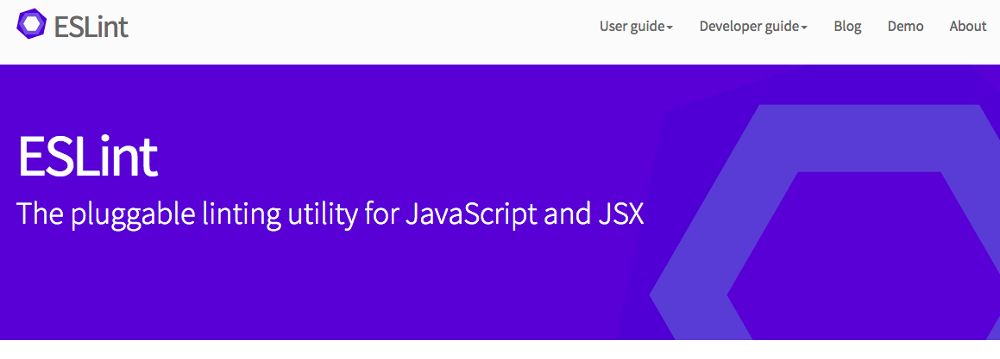
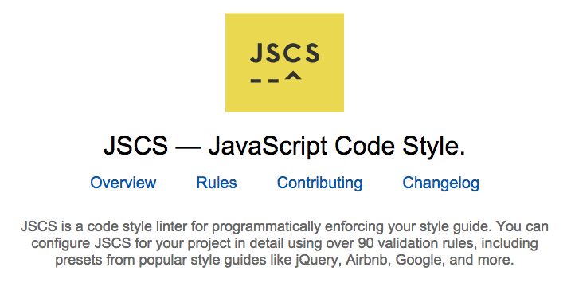

# Linting in webpack

Nothing is easier than making mistakes when coding in JavaScript. Linting is one of those techniques that can help you to make less mistakes and spot issues before they become actual problems.

Perhaps the most known linter that started it all for JavaScript is Douglas Crockford's [JSLint](http://www.jslint.com/). It is opinionated like the man himself. The next step in evolution was [JSHint](http://jshint.com/). It took the opinionated edge out of JSLint and allowed for more customization.

[ESLint](http://eslint.org/) is the newest tool in vogue. It has learned from its predecessors and takes linting to the next level. Besides allowing you to implement custom rules, you can hook it with custom parsers and reporters. This means ESLint will work with Babel and JSX syntax. The project rules have been well documented and you will have control over their severity. These features alone make it a powerful tool.

Besides linting for issues it can be useful to manage code style on some level. Nothing is more annoying than having to work with source that has mixed tabs or spaces and all kinds of shenanigans. Stylistically consistent code reads better and is easier to work with particularly in a team environment.

[JSCS](http://jscs.info/) is a tool that makes it possible to define a style guide of your own for JavaScript code. It is easy to integrate into your project through webpack. ESLint implements a large part of its functionality, though, and it is possible you may get away with ESLint only.

In this chapter I'll go through these tools briefly. We'll integrate just ESLint into our project. Of course if you want, you can give the other tools a go. Just don't be surprised that they aren't included in the demonstration code.

## Webpack and JSHint

Interestingly no JSLint loader seems to exist for webpack yet. Fortunately there's one for JSHint. On a legacy project setting it up with webpack is easy. We won't be using it for our application but it's a good thing to know. At least you'll see some familiar patterns.

You will need to install [jshint-loader](https://www.npmjs.com/package/jshint-loader) to your project (`npm i jshint-loader --save-dev`). In addition you will need a little bit of configuration.

```javascript
module: {
  preLoaders: [
    {
      test: /\.js$/,
      // define an include so we check just the files we need
      include: path.resolve(ROOT_PATH, 'app'),
      loader: 'jshint'
    }
  ]
}
```

You can also define custom settings using a `jshint` object. The project README covers that in detail. The tool will look into specific rules to apply from `.jshintrc`. Those have been covered at JSHint documentation in detail. An example configuration could look like this:

**.jshintrc**

```json
{
  "bitwise": true,
  "browser": true,
  "camelcase": false,
  "curly": true,
  "eqeqeq": true,
  "esnext": true,
  "immed": true,
  "indent": 2,
  "latedef": false,
  "newcap": true,
  "noarg": true,
  "node": true,
  "quotmark": "double",
  "strict": true,
  "trailing": true,
  "undef": true,
  "unused": true,
  "sub": true
}
```

Besides setting it up with webpack it can be highly beneficial to look into an integration with your editor or IDE. Having warnings and errors inline makes a world of difference. webpack will still complain but an integrated approach has its benefits.

## Setting Up ESLint



[ESLint](http://eslint.org/) is a recent linting solution for JavaScript. It builds on top of ideas presented by JSLint and JSHint. Most importantly it allows you to develop custom rules. As a result a nice set of rules have been developed for React in form of [eslint-plugin-react](https://www.npmjs.com/package/eslint-plugin-react).

### Connecting ESlint with `package.json`

In order to integrate ESLint with our project, we'll need to do a couple of little tweaks. First we'll need to hit

> npm i babel-eslint eslint eslint-plugin-react --save-dev

This will add ESLint and the plugin we want to use as our project development dependency. Next we'll need to do some configuration to make linting work in our project.

**package.json**

```json
"scripts": {
  ...
  "lint": "eslint . --ext .js --ext .jsx"
}
...
```

This will trigger ESLint against all JS and JSX files of our project. That's definitely too much so we'll need to restrict it. Set up *.eslintignore* to the project root like this:

**.eslintignore**

```bash
build/
```

Next we'll need to activate [babel-eslint](https://www.npmjs.com/package/babel-eslint) so that ESLint works with our Babel code. In addition we need to activate React specific rules and set up a couple of our own. You can adjust these to your liking. You'll find more information about the rules at [the official rule documentation](http://eslint.org/docs/rules/).

**.eslintrc**

```json
{
  "parser": "babel-eslint",
  "env": {
    "browser": true,
    "node": true
  },
  "plugins": [
    "react"
  ],
  "rules": {
    "new-cap": 0,
    "strict": 0,
    "no-underscore-dangle": 0,
    "no-use-before-define": 0,
    "eol-last": 0,
    "quotes": [2, "single"],
    "react/jsx-boolean-value": 1,
    "react/jsx-quotes": 1,
    "react/jsx-no-undef": 1,
    "react/jsx-uses-react": 1,
    "react/jsx-uses-vars": 1,
    "react/no-did-mount-set-state": 1,
    "react/no-did-update-set-state": 1,
    "react/no-multi-comp": 1,
    "react/no-unknown-property": 1,
    "react/react-in-jsx-scope": 1,
    "react/self-closing-comp": 1
  }
}
```

Note how we can define severity of an individual rule by passing it a number. Zero or `false` would mean a rule is set off. One would mark it as a warning. Two would yield an error. In some cases you can pass additional parameters to a rule by using an array notation.

If you hit `npm run lint` now, you should get some errors and warnings to fix depending on the rules you have set up. Go ahead and fix them if there are any. You can check [the book site](https://github.com/survivejs/webpack) for potential fixes if you get stuck.

T> Note that like some other tools, such as JSCS and JSHint, ESLint supports `package.json` based configuration. Simply add a `eslintConfig` field to it and write the configuration there.

T> It is possible to generate a sample `.eslintrc` using `eslint --init` (or `node_modules/.bin/eslint --init` for local install). This can be useful on new projects.

### Dealing with `ELIFECYCLE` Error

In case the linting process fails, `npm` will give you a nasty looking `ELIFECYCLE` error.A good way to achieve a tidier output is to invoke `npm run lint --silent`. That will hide the `ELIFECYCLE` bit. You can define an alias for this purpose. At Unix you would do `alias run='npm run --silent'` and then `run <script>`.

Alternatively you could pipe output to `true` like this:

**package.json**

```json
"scripts": {
  ...
  "lint": "eslint . --ext .js --ext .jsx || true"
}
...
```

The potential problem with this approach is that in case you invoke `lint` through some other command, it will pass the test even if there are failures! In other words if you have another script that does something like `npm run lint && npm run build`, it will build regardless of the output of the first command.

### Connecting ESLint with webpack

We can make webpack emit ESLint messages for us by using [eslint-loader](https://www.npmjs.com/package/eslint-loader). As the first step hit

> npm i eslint-loader --save-dev

Next we need to tweak our development configuration to include it. Add the following section to it:

**webpack.config.js**

```javascript
if(TARGET === 'dev') {
  module.exports = merge(common, {
    ...
    module: {
      preLoaders: [
        {
          test: /\.jsx?$/,
          // we are using `eslint-loader` explicitly since
          // we have ESLint module installed. This way we
          // can be certain that it uses the right loader
          loader: 'eslint-loader',
          include: path.resolve(ROOT_PATH, 'app')
        }
      ]
    },
    output: {...},
    ...
  });
}
```

We are using `preLoaders` section here as we want to play it safe. This section is executed before possible `loaders` get triggered. We won't even try to compile code if it doesn't pass our linting.

If you execute `npm start` now and break some linting rule while developing, you should see that in terminal output.

## Customizing ESLint

Even though you can get very far with vanilla ESLint there are several techniques you should be aware of. For instance sometimes you might want to skip some particular rules per file or you might want to implement rules of your own. We'll cover these cases briefly next.

### Skipping ESLint Rules

Sometimes you'll want to skip certain rules per file or per line. This can be useful when you happen to have some exceptional case in your code where some particular rule doesn't make sense. As usual exception confirms the rule. Consider the following examples:

```javascript
// everything
/* eslint-disable */
...
/* eslint-enable */
```

```javascript
// specific rule
/* eslint-disable no-unused-vars */
...
/* eslint-enable no-unused-vars */
```

```javascript
// tweaking a rule
/* eslint no-comma-dangle:1 */
```

```javascript
// disable rule per line
alert('foo'); // eslint-disable-line no-alert
```

Note that the rule specific examples assume you have the rules in your configuration in the first place! You cannot specify new rules here. Instead you can modify the behavior of existing rules.

### Writing Your Own Rules

ESLint rules rely on Abstract Syntax Tree (AST) definition of JavaScript. It is a data structure that describes JavaScript code after it has been lexically analyzed. There are tools such as [recast](https://github.com/benjamn/recast) that allow you perform transformations on JavaScript code by using AST transformations. The idea is that you match some structure, then transform it somehow and convert AST back to JavaScript.

To get a better idea of how AST works and what it looks like you can check [Esprima online JavaScript AST visualization](http://esprima.org/demo/parse.html) or [JS AST Explorer by Felix Kling](http://felix-kling.de/esprima_ast_explorer/). Alternatively you can install `recast` and examine the output it gives. That is the structure we'll be working with at ESLint rules.

In ESLint's case we just want to check the structure and report in case something is wrong. Getting a simple rule done is surprisingly simple:

1. Set up a new project named `eslint-plugin-custom`. You can replace `custom` with whatever you want. ESLint follows this naming convention.
2. Hit `npm init` to create a dummy `package.json`
3. Set up `index.js` in the project root with content like this:

**eslint-plugin-custom/index.js**

```javascript
module.exports = {
  rules: {
    demo: function(context) {
      return {
        Identifier: function(node) {
          context.report(node, 'This is unexpected!');
        }
      };
    }
  }
};
```

In this case we just report for every identifier found. In practice you'll likely want to do something more complex than this but this is a good starting point.

Next you need to hit `npm link` within `eslint-plugin-custom`. This will make your plugin visible within your system. `npm link` allows you to consume easily a development version of a library you are developing. To reverse the link you can hit `npm unlink` when you feel like it.

T> If you want to do something serious, you should point to your plugin through `package.json`.

Next we need to alter our project configuration to make it to find the plugin and the rule within.

**.eslintrc**

```json
"plugins": {
  "custom"
},
"rules": {
  "custom/demo": 1,
  ...
}
```

If you invoke ESLint now, you should see a bunch of warnings. Mission accomplished!

Of course the rule doesn't do anything useful yet. To get forward I recommend checking out the official documentation about [plugins](http://eslint.org/docs/developer-guide/working-with-plugins.html) and [rules](http://eslint.org/docs/developer-guide/working-with-rules.html). You can also check out some of the existing rules and plugins for inspiration to see how they achieve certain things.

### ESLint Resources

Besides the official documentation available at [eslint.org](http://eslint.org/), you should check out the following blog posts:

* [Lint Like It's 2015](https://medium.com/@dan_abramov/lint-like-it-s-2015-6987d44c5b48) - This post by Dan Abramov shows how to get ESLint work well with Sublime Text.
* [Detect Problems in JavaScript Automatically with ESLint](http://davidwalsh.name/eslint) - A good tutorial on the topic.
* [Understanding the Real Advantages of Using ESLint](http://rangle.io/blog/understanding-the-real-advantages-of-using-eslint/) - Evan Schultz's post digs into details.
* [eslint-plugin-smells](https://github.com/elijahmanor/eslint-plugin-smells) - This plugin by Elijah Manor allows you to lint against various JavaScript smells. Recommended.

If you just want some starting point quickly, you can pick one of [eslint-config- packages](https://www.npmjs.com/search?q=eslint-config) or go with [standard](https://www.npmjs.com/package/standard) style. By the looks of it `standard` has [some issues with JSX](https://github.com/feross/standard/issues/138) so be careful with that.

## Linting CSS

[csslint](https://www.npmjs.com/package/csslint) allows us to lint CSS. [csslint-loader](https://www.npmjs.com/package/csslint-loader) makes it possible to integrate it into our project. To get started hit

> npm i csslint csslint-loader --save-dev

Next we'll need to integrate it with our configuration:

**webpack.config.js**

```javascript
...

if(TARGET === 'dev') {
  module.exports = merge(common, {
    module: {
      preLoaders: [
        {
          test: /\.css$/,
          loader: 'csslint'
        },
        {
          test: /\.jsx?$/,
          loader: 'eslint-loader',
          include: path.resolve(ROOT_PATH, 'app')
        }
      ],
      ...
    }
  });
}
```

To keep things nice and tidy I put it into the `preLoaders` section of configuration.

**.csslintrc**

```json
{
  "adjoining-classes": false,
  "box-sizing": false,
  "box-model": false,
  "compatible-vendor-prefixes": false,
  "floats": false,
  "font-sizes": false,
  "gradients": false,
  "important": false,
  "known-properties": false,
  "outline-none": false,
  "qualified-headings": false,
  "regex-selectors": false,
  "shorthand": false,
  "text-indent": false,
  "unique-headings": false,
  "universal-selector": false,
  "unqualified-attributes": false
}
```

I decided to use a set of rules from Twitter Bootstrap. These seem like a good starting point.

**package.json**

```json
"scripts": {
  ...
  "lint": "npm run lint-js && npm run lint-css",
  "lint-js": "eslint . --ext .js --ext .jsx",
  "lint-css": "csslint app/stylesheets --quiet"
}
```

If you hit `npm run lint-css` now, you should see some output, hopefully without errors. That `--quiet` flag is there to keep the tool silent unless there are errors.

Thanks to the webpack configuration we did, you should get output during `npm start` process as well. In addition you should consider setting up csslint with your editor. That way you get more integrated development experience.

## Checking JavaScript Style with JSCS



Especially in a team environment it can be annoying if one guy uses tabs and other spaces. There can also be discrepancies between space usage. Some like to use two, some like four for indentation. In short it can get pretty messy without any discipline. Fortunately there is a tool known as JSCS. It will allow you to define a style guide for your project. We won't use the tool in this project but it's good to be aware of it.

[jscs-loader](https://github.com/unindented/jscs-loader) provides webpack hooks to the tool. Integration is similar as in the case of ESLint. You would define `.jscsrc` with your style guide rules and use configuration like this:

```javascript
module: {
  preLoaders: [
    {
      test: /\.jsx?$/,
      loaders: ['eslint', 'jscs'],
      include: path.resolve(ROOT_PATH, 'app')
    }
  ]
}
```

To make it work with JSX, you'll need to point it to `esprima-fb` parser through `.jscsrc`. There are also various other options and even some presets. Consider the example below:

**.jscsrc**

```json
{
  "esprima": "esprima-fb",
  "preset": "google",

  "fileExtensions": [".js", ".jsx"],

  "requireCurlyBraces": true,
  "requireParenthesesAroundIIFE": true,

  "maximumLineLength": 120,
  "validateLineBreaks": "LF",
  "validateIndentation": 4,

  "disallowKeywords": ["with"],
  "disallowSpacesInsideObjectBrackets": null,
  "disallowImplicitTypeConversion": ["string"],

  "safeContextKeyword": "that",

  "excludeFiles": [
    "dist/**",
    "node_modules/**"
  ]
}
```

T> ESLint implements a large part of the functionality provided by JSCS. It is possible you can skip JSCS altogether provided you configure ESLint correctly. There's a large amount of presets available.

T> Note that like some other tools, such as ESLint and JSHint, JSCS supports `package.json` based configuration. Simply add a `jscsConfig` field to it and write the configuration there.

## Conclusion

In this chapter you learned how to lint your code using webpack in various ways. It is one of those techniques that yields benefits over longer term as you get to fix possible problems before they become actual issues.
