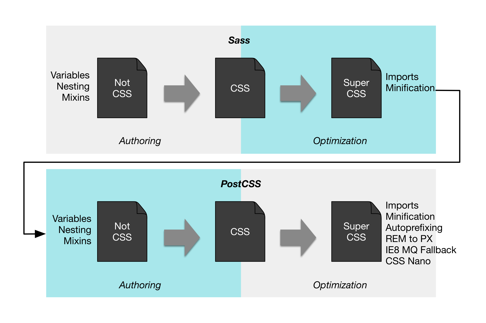
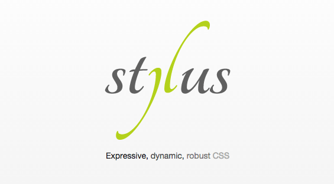

# Styling React

Traditionally, web pages have been split up into markup (HTML), styling (CSS), and logic (JavaScript). Thanks to React and similar approaches, we've begun to question this split. We still may want to separate our concerns somehow. But the split can be on different axes.

This change in the mindset has lead to new ways to think about styling. With React, we're still figuring out the best practices. Some early patterns have begun to emerge, however. As a result it is difficult to provide any definite recommendations at the moment. Instead, I will go through various approaches so you can make up your mind based on your exact needs.

## Old School Styling

The old school approach to styling is to sprinkle some *ids* and *classes* around, set up CSS rules, and hope for the best. In CSS everything is global by default. Nesting definitions(e.g., `.main .sidebar .button`) creates implicit logic to your styling. Both features lead to a lot of complexity as your project grows. This approach can be acceptable when starting out, but as you develop, you most likely want to migrate away from it.

### Webpack Configuration for Vanilla CSS

It is easy to configure vanilla CSS in Webpack. Consider the example below:

**webpack.config.js**

```javascript
var common = {
  ...
  module: {
    loaders: [
      {
        test: /\.css$/,
        loaders: ['style', 'css'],
        include: PATHS.style
      }
    ]
  },
  ...
};
```

First, [css-loader](https://www.npmjs.com/package/css-loader) goes through possible `@import` and `url()` statements within the matched files and treats them as regular `require`. This allows us to rely on various other loaders, such as [file-loader](https://www.npmjs.com/package/file-loader) or [url-loader](https://www.npmjs.com/package/url-loader).

`file-loader` generates files, whereas `url-loader` can create inline data URLs for small resources. This can be useful for optimizing application loading. You avoid unnecessary requests while providing a slightly bigger payload. Small improvements can yield large benefits if you depend on a lot of small resources in your style definitions.

Finally, `style-loader` picks up `css-loader` output and injects the CSS into the bundle. As we saw earlier in the build chapter, it is possible to use `ExtractTextPlugin` to generate a separate CSS file.

T> If you want to enable sourcemaps for CSS, you should use `['style', 'css?sourceMap']` and set `output.publicPath` to an absolute url. *css-loader* [issue 29](https://github.com/webpack/css-loader/issues/29) discusses this problem further.

## CSS Methodologies

What happens when your application starts to expand and new concepts get added? Broad CSS selectors are like globals. The problem gets even worse if you have to deal with loading order. If selectors end up in a tie, the last declaration wins, unless there's `!important` somewhere. It gets complex very fast.

We could battle this problem by making the selectors more specific, using some naming rules, and so on. That just delays the inevitable. As people have battled with this problem for a while, various methodologies have emerged.

Particularly, [OOCSS](http://oocss.org/) (Object-Oriented CSS), [SMACSS](https://smacss.com/) (Scalable and Modular Approach for CSS), and [BEM](https://en.bem.info/method/) (Block Element Modifier) are well known. Each of them solves problems of vanilla CSS in their own way.

### BEM

BEM originates from Yandex. The goal of BEM is to allow reusable components and code sharing. Sites, such as [Get BEM](http://getbem.com/) help you to understand the methodology in more detail.

Maintaining long class names which BEM requires can be arduous. Thus various libraries have appeared to make this easier. For React, examples of these are [react-bem-helper](https://www.npmjs.com/package/react-bem-helper), [react-bem-render](https://www.npmjs.com/package/react-bem-render), and [bem-react](https://www.npmjs.com/package/bem-react).

Note that [postcss-bem-linter](https://www.npmjs.com/package/postcss-bem-linter) allows you to lint your CSS for BEM conformance.

### OOCSS and SMACSS

Just like BEM, both OOCSS and SMACSS come with their own conventions and methodologies. As of this writing, no React specific helper libraries exist for OOCSS and SMACSS.

### Pros and Cons

The primary benefit of adopting a methodology is that it brings structure to your project. Rather than writing ad hoc rules and hoping everything works, you will have something stronger to fall back onto. The methodologies overcome some of the basic issues and help you develop good software over the long term. The conventions they bring to a project help with maintenance and are less prone to lead to a mess.

On the downside, once you adopt one, you are pretty much stuck with that and it's going to be difficult to migrate. But if you are willing to commit, there are benefits to gain.

The methodologies also bring their own quirks (e.g., complex naming schemes). This may make certain things more complicated than they have to be. They don't necessarily solve any of the bigger underlying issues. They rather provide patches around them.

There are various approaches that go deeper and solve some of these fundamental problems. That said, it's not an either-or proposition. You may adopt a methodology even if you use some CSS processor.

## Less, Sass, Stylus, PostCSS, cssnext



Vanilla CSS is missing some functionality that would make maintenance work easier. Consider something basic like variables, nesting, mixins, math or color functions. It would also be nice to be able to forget about browser specific prefixes. These are small things that add up quite fast and make it annoying to write vanilla CSS.

Sometimes, you may see terms *preprocessor* or *postprocessor*. [Stefan Baumgartner](https://medium.com/@ddprrt/deconfusing-pre-and-post-processing-d68e3bd078a3) calls these tools simply *CSS processors*. The image above adapted based on Stefan's work gets to the point. The tooling operates both on authoring and optimization level. By authoring we mean features that make it easier to write CSS. Optimization features operate based on vanilla CSS and convert it into something more optimal for browsers to consume.

The interesting thing is that you may actually want to use multiple CSS processors. Stefan's image illustrates how you can author your code using Sass and still benefit from processing done through PostCSS. For example, it can *autoprefix* your CSS code so that you don't have to worry about prefixing per browser anymore.

### Less


[Less](http://lesscss.org/) is a popular CSS processor that is packed with functionality. In Webpack using Less doesn't take a lot of effort. [less-loader](https://www.npmjs.com/package/less-loader) deals with the heavy lifting:

```javascript
{
  test: /\.less$/,
  loaders: ['style', 'css', 'less'],
  include: PATHS.style
}
```

There is also support for Less plugins, sourcemaps, and so on. To understand how those work you should check out the project itself.

### Sass


[Sass](http://sass-lang.com/) is a popular alternative to Less. You should use [sass-loader](https://www.npmjs.com/package/sass-loader) with it. Remember to install `node-sass` to your project as the loader has a peer dependency on that. Webpack doesn't take much configuration:

```javascript
{
  test: /\.scss$/,
  loaders: ['style', 'css', 'sass'],
  include: PATHS.style
}
```

Check out the loader for more advanced usage.

### Stylus



[Stylus](https://learnboost.github.io/stylus/) is a Python inspired way to write CSS. Besides providing an indentation based syntax, it is a full-featured processor. When using Webpack, you can use [stylus-loader](https://www.npmjs.com/package/stylus-loader) to Stylus within your project. Configure as follows:

```javascript
{
  test: /\.styl$/,
  loaders: ['style', 'css', 'stylus'],
  include: PATHS.style
}
```

You can also use Stylus plugins with it by setting `stylus.use: [plugin()]`. Check out the loader for more information.

### PostCSS


[PostCSS](http://postcss.org/) allows you to perform transformations over CSS through JavaScript plugins. You can even find plugins that provide you Sass-like features. PostCSS can be thought as the equivalent of Babel for styling. It can be used through [postcss-loader](https://www.npmjs.com/package/postcss-loader) with Webpack as below:

```javascript
var autoprefixer = require('autoprefixer');
var precss = require('precss');

module.exports = {
  module: {
    loaders: [
      {
        test: /\.css$/,
        loaders: ['style', 'css', 'postcss'],
        include: PATHS.style
      }
    ]
  },
  // PostCSS plugins go here
  postcss: function () {
      return [autoprefixer, precss];
  }
};
```

### cssnext


[cssnext](https://cssnext.github.io/) is a PostCSS plugin that allows us to experience the future now. There are some restrictions, but it may be worth a go. In Webpack it is simply a matter of installing [cssnext-loader](https://www.npmjs.com/package/cssnext-loader) and attaching it to your CSS configuration. In our case, you would end up with the following:

```javascript
{
  test: /\.css$/,
  loaders: ['style', 'css', 'cssnext'],
  include: PATHS.style
}
```

Alternatively, you could consume it through *postcss-loader* as a plugin if you need more control.

The advantage of PostCSS and cssnext is that you will literally be coding in the future. As browsers get better and adopt the standards, you don't have to worry about porting.

### Pros and Cons

Compared to vanilla CSS, processors bring a lot to the table. They deal with certain annoyances (e.g., autoprefixing) while improving your productivity. PostCSS is more granular by definition and allows you to use just the features you want. Processors, such as Less or Sass, are more involved. These approaches can be used together, though, so you could, for instance, author your styling in Sass and then apply some PostCSS plugins to it as you see necessary.

In our project, we could benefit from cssnext even if we didn't make any changes to our CSS. Thanks to autoprefixing, rounded corners of our lanes would look good even in legacy browsers. In addition, we could parameterize styling thanks to variables.

## React Based Approaches

With React we have some additional alternatives. What if the way we've been thinking about styling has been misguided? CSS is powerful, but it can become an unmaintainable mess without some discipline. Where do we draw the line between CSS and JavaScript?

There are various approaches for React that allow us to push styling to the component level. It may sound heretical. React, being an iconoclast, may lead the way here.

### Inline Styles to Rescue

Ironically, the way solutions based on React solve this is through inline styles. Getting rid of inline styles was one of the main reasons for using separate CSS files in the first place. Now we are back there. This means that instead of something like this:

```javascript
render(props, context) {
  const notes = this.props.notes;

  return <ul className='notes'>{notes.map(this.renderNote)}</ul>;
}
```

and accompanying CSS, we'll do something like this:

```javascript
render(props, context) {
  const notes = this.props.notes;
  const style = {
    margin: '0.5em',
    paddingLeft: 0,
    listStyle: 'none'
  };

  return <ul style={style}>{notes.map(this.renderNote)}</ul>;
}
```

Like with HTML attribute names, we are using the same camelcase convention for CSS properties.

Now that we have styling at the component level, we can implement logic that also alters the styles easily. One classic way to do this has been to alter class names based on the outlook we want. Now we can adjust the properties we want directly.

We have lost something in process, though. Now all of our styling is tied to our JavaScript code. It is going to be difficult to perform large, sweeping changes to our codebase as we need to tweak a lot of components to achieve that.

We can try to work against this by injecting a part of styling through props. A component could patch its style based on a provided one. This can be improved further by coming up with conventions that allow parts of style configuration to be mapped to some specific part. We just reinvented selectors on a small scale.

How about things like media queries? This naïve approach won't quite cut it. Fortunately, people have come up with libraries to solve these tough problems for us.

According to Michele Bertoli basic features of these libraries are

* Autoprefixing - e.g., for `border`, `animation`, `flex`.
* Pseudo classes - e.g., `:hover`, `:active`.
* Media queries - e.g., `@media (max-width: 200px)`.
* Styles as Object Literals - See the example above.
* CSS style extraction - It is useful to be able to extract separate CSS files as that helps with the initial loading of the page. This will avoid a flash of unstyled content (FOUC).

I will cover some of the available libraries to give you a better idea how they work. See [Michele's list](https://github.com/MicheleBertoli/css-in-js) for a more a comprehensive outlook of the situation.

### Radium

[Radium](http://projects.formidablelabs.com/radium/) has certain valuable ideas that are worth highlighting. Most importantly it provides abstractions required to deal with media queries and pseudo classes (e.g., `:hover`). It expands the basic syntax as follows:

```javascript
const styles = {
  button: {
    padding: '1em',

    ':hover': {
      border: '1px solid black'
    },

    '@media (max-width: 200px)': {
      width: '100%',

      ':hover': {
        background: 'white',
      }
    }
  },
  primary: {
    background: 'green'
  },
  warning: {
    background: 'yellow'
  },
};

...

<button style={[styles.button, styles.primary]}>Confirm</button>
```

For `style` prop to work, you'll need to annotate your classes using `@Radium` decorator.

### React Style

[React Style](https://github.com/js-next/react-style) uses the same syntax as React Native [StyleSheet](https://facebook.github.io/react-native/docs/stylesheet.html#content). It expands the basic definition by introducing additional keys for fragments.

```javascript
import StyleSheet from 'react-style';

const styles = StyleSheet.create({
  primary: {
    background: 'green'
  },
  warning: {
    background: 'yellow'
  },
  button: {
    padding: '1em'
  },
  // media queries
  '@media (max-width: 200px)': {
    button: {
      width: '100%'
    }
  }
});

...

<button styles={[styles.button, styles.primary]}>Confirm</button>
```

As you can see, we can use individual fragments to get the same effect as Radium modifiers. Also media queries are supported. React Style expects that you manipulate browser states (e.g., `:hover`) through JavaScript. Also CSS animations won't work. Instead, it's preferred to use some other solution for that.

Interestingly, there is a [React Style plugin for Webpack](https://github.com/js-next/react-style-webpack-plugin). It can extract CSS declarations into a separate bundle. Now we are closer to the world we're used to, but without cascades. We also have our style declarations on the component level.

### JSS

[JSS](https://github.com/jsstyles/jss) is a JSON to StyleSheet compiler. It can be convenient to represent styling using JSON structures as this gives us easy namespacing. Furthermore it is possible to perform transformations over the JSON to gain features, such as autoprefixing. JSS provides a plugin interface just for this.

JSS can be used with React through [react-jss](https://www.npmjs.com/package/react-jss). There's also an experimental [jss-loader](https://www.npmjs.com/package/jss-loader) for Webpack. You can use JSS through *react-jss* like this:

```javascript
...
import classNames from 'classnames';
import useSheet from 'react-jss';

const styles = {
  button: {
    padding: '1em'
  },
  'media (max-width: 200px)': {
    button: {
      width: '100%'
    }
  },
  primary: {
    background: 'green'
  },
  warning: {
    background: 'yellow'
  }
};

@useSheet(styles)
export default class ConfirmButton extends React.Component {
  render() {
    const {classes} = this.props.sheet;

    return <button
      className={classNames(classes.button, classes.primary)}>
        Confirm
      </button>;
  }
}
```

The approach supports pseudoselectors, i.e., you could define a selector within, such as `&:hover`, within a definition and it would just work.

### React Inline

[React Inline](https://github.com/martinandert/react-inline) is an interesting twist on StyleSheet. It generates CSS based on `className` prop of elements where it is used. The example above could be adapted to React Inline like this:

```javascript
import cx from 'classnames';
...

class ConfirmButton extends React.Component {
  render() {
    const {className} = this.props;
    const classes = cx(styles.button, styles.primary, className);

    return <button className={classes}>Confirm</button>;
  }
}
```

Unlike React Style, the approach supports browser states (e.g., `:hover`). Unfortunately, it relies on its own custom tooling to generate React code and CSS which it needs to work. As of the time of this writing, there's no Webpack loader available.

### jsxstyle

Pete Hunt's [jsxstyle](https://github.com/petehunt/jsxstyle) aims to mitigate some problems of React Style's approach. As you saw in previous examples, we still have style definitions separate from the component markup. jsxstyle merges these two concepts. Consider the following example:

```javascript
// PrimaryButton component
<button
  padding='1em'
  background='green'
>Confirm</button>
```

The approach is still in its early days. For instance, support for media queries is missing. Instead of defining modifiers as above, you'll end up defining more components to support your use cases.

Just like React Style, jsxstyle comes with a Webpack loader that can extract CSS into a separate file.

## CSS Modules

As if there weren't enough styling options for React, there's one more that's worth mentioning. [CSS Modules](https://github.com/css-modules/css-modules) starts from the premise that CSS rules should be local by default. Globals should be treated as a special case. Mark Dalgleish's post [The End of Global CSS](https://medium.com/seek-ui-engineering/the-end-of-global-css-90d2a4a06284) goes into more detail about this.

In short, if you make it difficult to use globals, you manage to solve the biggest problem of CSS. The approach still allows us to develop CSS as we've been used to. This time we're operating in a safer, local context by default.

This itself solves a large amount of problems libraries above try to solve in their own ways. If we need global styles, we can still get them. We still might want to have some around for some higher level styling after all. This time we're being explicit about it.

To give you a better idea, consider the example below:

**style.css**

```css
.primary {
  background: 'green';
}

.warning {
  background: 'yellow';
}

.button {
  padding: 1em;
}

.primaryButton {
  composes: primary button;
}

@media (max-width: 200px) {
  .primaryButton {
    composes: primary button;

    width: 100%;
  }
}
```

**button.jsx**

```javascript
import styles from './style.css';

...

<button className=`${styles.primaryButton}`>Confirm</button>
```

As you can see, this approach provides a balance between what people are familiar with and what React specific libraries do. It would not surprise me a lot if this approach gained popularity even though it's still in its early days. See [CSS Modules Webpack Demo](https://css-modules.github.io/webpack-demo/) for more examples.

T> [gajus/react-css-modules](https://github.com/gajus/react-css-modules) makes it even more convenient to use CSS Modules with React. Using it, you don't need to refer to the `styles` object anymore, and you are not forced to use camelCase for naming.

T> Glen Maddern discusses the topic in greater detail in his article named [CSS Modules - Welcome to the Future](http://glenmaddern.com/articles/css-modules).

## Conclusion

It is simple to try out various styling approaches with Webpack. You can do it all, ranging from vanilla CSS to more complex setups. React specific tooling even comes with loaders of their own. This makes it easy to try out different alternatives.

React based styling approaches allow us to push styles to the component level. This provides an interesting contrast to conventional approaches where CSS is kept separate. Dealing with component specific logic becomes easier. You will lose some power provided by CSS. In return you gain something that is simpler to understand. It is also harder to break.

CSS Modules strike a balance between a conventional approach and React specific approaches. Even though it's a newcomer, it shows a lot of promise. The biggest benefit seems to be that it doesn't lose too much in the process. It's a nice step forward from what has been commonly used.

There are no best practices yet, and we are still figuring out the best ways to do this in React. You will likely have to do some experimentation of your own to figure out what ways fit your use case the best.
